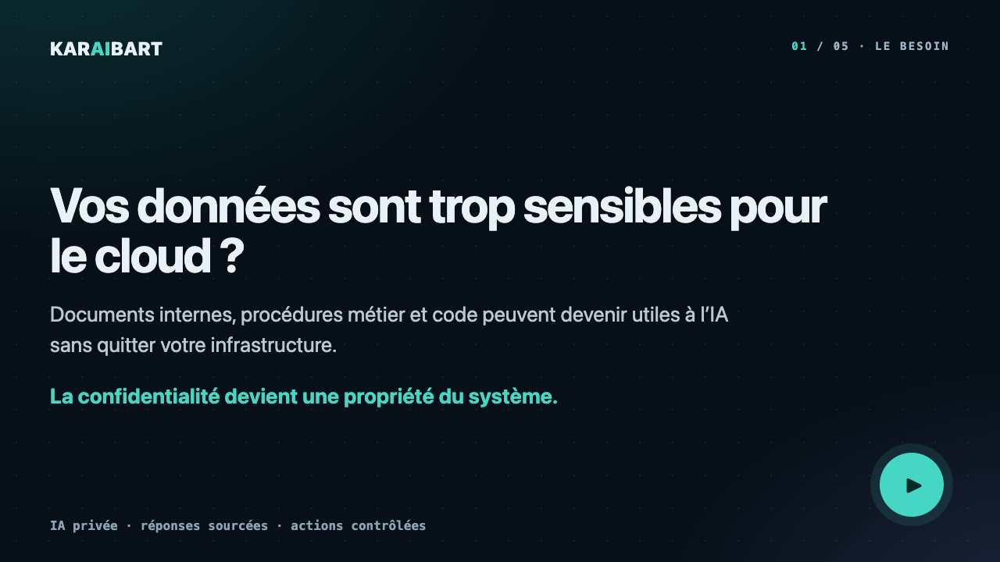

# Claude Volny · Karaibart

### J'aide les équipes qui manipulent des données sensibles à utiliser l'IA sans les envoyer dans le cloud.

**IA locale · RAG sourcé · agents contrôlés · Apple Silicon**

[Voir le site](https://karaibart.fr) · [Voir la vidéo — 31 s](assets/karaibart-demo.mp4) · [Cadrer un projet](https://karaibart.fr/contact/)

---

## Ce que je déploie

- **Assistants documentaires privés** : réponses reliées à leurs sources, refus explicite quand la preuve manque.
- **Agents métier contrôlés** : lecture seule par défaut et approbation humaine avant toute écriture sensible.
- **Infrastructure d'inférence locale** : plusieurs modèles, un budget RAM unique, services supervisés et mesures à froid comme à chaud.
- **Garde-fous de production** : sandbox, anti-SSRF, audit des dépendances, gates CI et évaluation continue.

## Projet phare — [Klody Code AI](https://github.com/klodynlov/klody-code-ai)

Un agent de code **100 % local** : modèle, outils, mémoire, RAG et connecteurs tournent sur la machine. Il combine une boucle ReAct, 69 schémas d'outils natifs, MCP client/serveur et un dashboard desktop Tauri.

- [Étude de cas technique](https://github.com/klodynlov/klody-code-ai/blob/main/docs/CASE-STUDY.md)
- [Architecture locale](https://github.com/klodynlov/klody-code-ai/blob/main/README-local-ai.md)
- [Frontend Tauri + React](https://github.com/klodynlov/klody-ui)
- [Feuille de route](docs/KLODY-ROADMAP.md)

## Preuves mesurées

| Écosystème | Mesure actuelle |
|---|---:|
| Dépôts suivis | **17** |
| Commits | **1 300+** |
| Fonctions de test déclarées | **6 700+** |
| Documents dans Library Brain | **25 376** |
| Chunks RAG indexés | **1 824 420** |
| Requêtes tierces sur karaibart.fr | **0** |

Mesures du **3 septembre 2026**. Les commandes et la distinction entre chiffres mesurés et déclarés sont publiées sur la page [Les mesures](https://karaibart.fr/laboratoire/mesures/).

## Stack utile

**Python · FastAPI · MLX · SQLite/FTS5/sqlite-vec · MCP · React · TypeScript · Rust/Tauri · pytest · CI sécurité**

Autres briques : [ram-aware-scheduler](https://github.com/klodynlov/ram-aware-scheduler), [Library Brain](https://karaibart.fr/projets/library-brain/), [TabICL local](https://github.com/klodynlov/tabicl-calibration-gate), [Libretto](https://github.com/klodynlov/Libretto) et [SampleBrain](https://github.com/klodynlov/SampleBrain).

---

## 🌱 Projet en lumière — [SilverBrain](docs/SILVERBRAIN.md)

Un assistant IA **intuitif, pensé pour les personnes que la technologie intimide** —
seniors et au-delà. On lui parle naturellement : il n'y a *rien à apprendre*.

Quatre piliers :

1. 🧠 **Intuitif** — langage naturel uniquement, compréhension par intention, aucune commande à mémoriser.
2. 🧭 **Profilage conversationnel** — apprend à connaître la personne (sans questionnaire) pour l'orienter vers des thématiques **LibraryBrain** qui la concernent vraiment.
3. 📅 **Accompagnement** — rappels proactifs, aide à la lecture/mémoire, lien avec les proches (**MCP**), socle extensible.
4. 🗣️ **Formulation adaptative** — ajuste *comment* il parle (vocabulaire, rythme, ton) aux contraintes d'un public réfractaire à la technologie.

📖 [Concept & scénario](docs/SILVERBRAIN.md) · 🗺️ [Feuille de route](docs/SILVERBRAIN-ROADMAP.md) · 🧬 [Modèle du profil](docs/SILVERBRAIN-PROFIL.md) · 🗣️ [Contrat de style](docs/SILVERBRAIN-STYLE.md) · 🔌 [Connecteurs MCP](docs/SILVERBRAIN-MCP.md) · 🎨 [Maquettes](docs/ui/landing.html)

> Réutilise VocalBrain (voix), LibraryBrain (thématiques/lecture) et Klody (orchestration + MCP) — 100 % local, aucune donnée dans le cloud.

---

## 🚀 Autres projets

- **LibraryBrain** — RAG local de livres (sqlite-vec + FTS5) qui alimente Klody.
- **VocalBrain** — outil autour de la voix / l'audio.
- **[Dream × World](https://github.com/klodynlov/dream-x-world)** — générateur de **mondes IA persistants & cohérents**, 100 % local. Un *Canon Engine* (retrieve → generate → vérif anti-contradiction → Best-of-N) garde le monde non-contradictoire dans la durée ; simulation temporelle multi-agents et monde exposé en **MCP** pour que les agents y jouent. — 🗺️ [Feuille de route](docs/DREAMXWORLD-ROADMAP.md)
- 📡 **[micro:bit en Bluetooth](docs/MICROBIT-BLUETOOTH.md)** — l'IA locale qui touche le monde physique : une carte **BBC micro:bit** connectée en **BLE** depuis Python (température, accéléromètre, boussole, boutons ⟶ afficheur LED, UART), exposée en **MCP** pour qu'un agent perçoive et agisse. Cœur sans dépendance + carte simulée ⟶ [33 tests](microbit/test_microbit.py) qui tournent sans matériel. — 🔌 [`microbit/`](microbit/)
- *(et d'autres explorations IA locale, audio, MCP…)*

## 🧰 Outils & feuille de route

- 🎯 [**Feuille de route**](docs/ROADMAP.md) — mes ambitions et leur avancement.
- 🗂️ [`tools/`](tools/) — petits utilitaires locaux, sans dépendance :
  [`classer_sessions.py`](tools/classer_sessions.py) (analyse des sessions Claude Code)
  et [`objectifs.py`](tools/objectifs.py) (suivi d'ambitions → dashboard HTML).

---

## ✍️ Mon carnet — [Le Carnet](https://klodynlov.github.io/klodynlov/blog/)

J'écris, à but informatif, sur ce qui me touche et m'intéresse : IA locale, agents, MCP, ingénierie du quotidien. Un *pseudo LinkedIn, mais pour moi* — des textes qui restent, à une adresse stable.

- 🔒 [Pourquoi je fais tourner mes agents IA à 100 % en local](https://klodynlov.github.io/klodynlov/blog/posts/2026-07-13-agents-ia-100-local.html)
- 🔌 [MCP, expliqué simplement : donner des mains à un modèle de langage](https://klodynlov.github.io/klodynlov/blog/posts/2026-07-06-mcp-donner-des-mains.html)
- 🧭 [Faire en sorte qu'un agent de code aille vraiment au bout](https://klodynlov.github.io/klodynlov/blog/posts/2026-06-28-agent-aller-au-bout.html)

> Blog **100 % statique** (aucun build), en ligne sur **[klodynlov.github.io/klodynlov/blog](https://klodynlov.github.io/klodynlov/blog/)** — [comment ça marche](docs/blog/README.md)

---

## Travailler ensemble

Vous avez des documents, du code ou des procédures qui **ne peuvent pas quitter votre infrastructure** ? Décrivez le cas d'usage et le matériel disponible : je réponds personnellement sous 48 h ouvrées.

**[Cadrer mon projet →](https://karaibart.fr/contact/)**

[LinkedIn](https://www.linkedin.com/in/claude-volny-94129894/) · [volnyclaude@protonmail.com](mailto:volnyclaude@protonmail.com)
