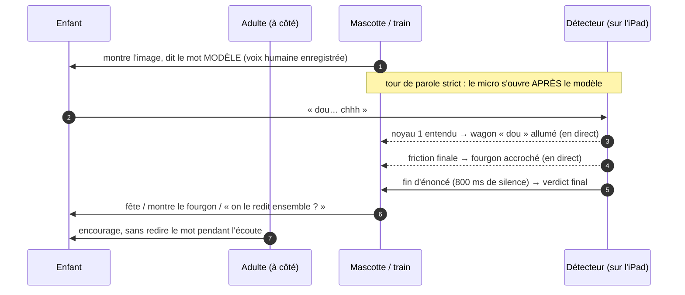
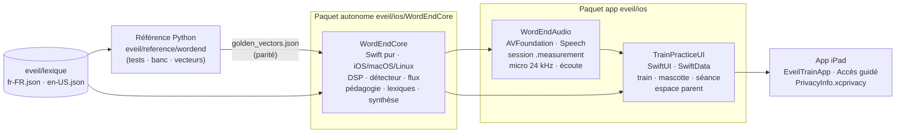
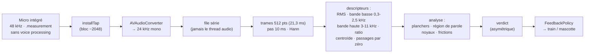
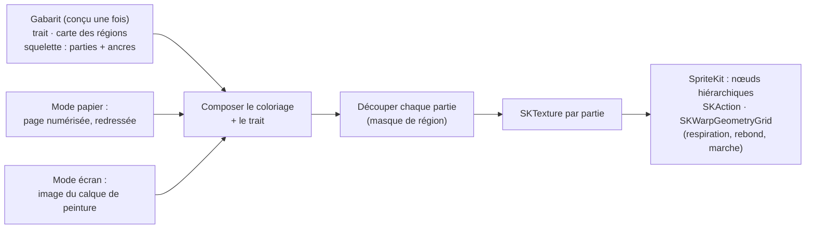
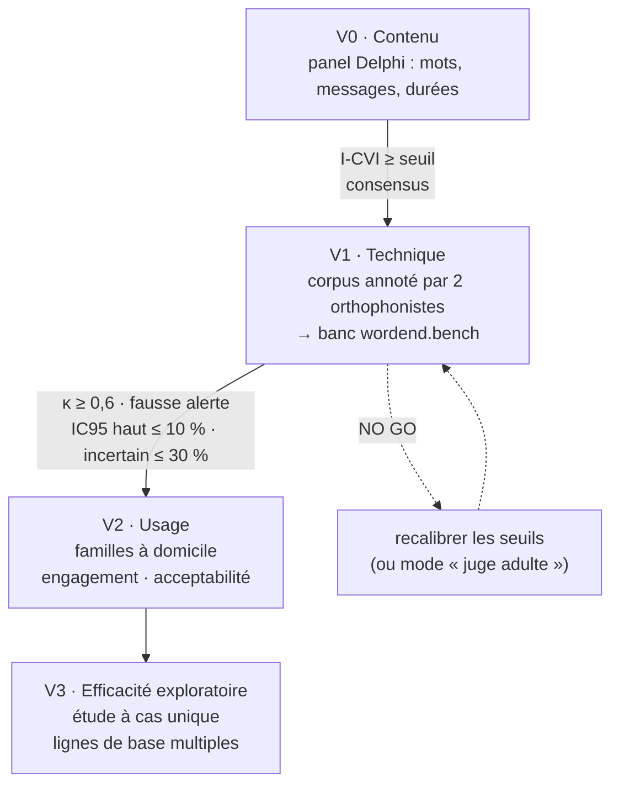

# 🚂 Suite Éveil — blueprint technique (iPad, 3 ans et +)

> **Nom de travail.** Deux apps iPad **gratuites, sans publicité, sans achat, sans traçage,
> 100 % sur l'appareil** : **le Petit Train des mots** (prononciation FR/EN — nom de code
> *OrthoSpeech*, **à renommer**, §7.4) et **l'Atelier de coloriage** (motricité fine).
> Swift / SwiftUI, frameworks Apple natifs.
>
> Rôle tenu pour ce document : architecte iOS senior + lead product designer petite enfance.
> Méthode du dépôt : **réalité technique avant prose** — chaque brique porte un statut, chaque
> affirmation une source ([état de l'art sourcé](EVEIL-SOURCES.md)), et ce qui est dit « prouvé »
> l'est par du code exécuté.

**Date :** 2026-09-24 · **Code :** [`eveil/`](../eveil/) · **Sources :** [EVEIL-SOURCES.md](EVEIL-SOURCES.md) · **Maquette :** [les états du train](ui/eveil-train.html)

| Statut | Sens |
|---|---|
| ✅ **PROUVÉ** | Vérifié par la documentation *et* par du code/test exécuté ici. |
| 🟢 **FAISABLE** | Briques documentées, intégration crédible — pas encore construite/mesurée ici. |
| 🟡 **EXPÉRIMENTAL** | À prototyper ou mesurer (vraies voix, vrais enfants) avant tout engagement. |
| ⛔ **NON VIABLE** | À abandonner ou à reporter dans l'état actuel. |

| Brique | Statut | Preuve |
|---|---|---|
| Détecteur de fin de mot — référence Python stdlib | ✅ PROUVÉ *sur signaux synthétiques* | 69 tests verts, démo exécutable ([`eveil/reference/`](../eveil/reference/)) |
| Asymétrie : jamais « il manque la fin » sans preuve d'absence | ✅ PROUVÉ *sur signaux synthétiques* | 0 fausse alerte sur 30 énoncés complets bruités (SNR 35 → 5 dB), 0 faux « complet » |
| Portage Swift `WordEndCore` (+ tests de parité) | 🟢 FAISABLE | Syntaxe vérifiée (tree-sitter, 23/23 fichiers) ; relecture indépendante : aucune erreur de compilation certaine, parité 17/17 reproduite ; **non compilé ici** → `swift test` sur Mac |
| Couche iOS (AVAudioEngine, SwiftUI, SwiftData) | 🟢 FAISABLE | Noms d'API vérifiés dans la doc Apple ; non compilé ici |
| « Rien ne quitte l'iPad » | ✅ PROUVÉ *statiquement* | Garde-fou [`verifier_confidentialite.py`](../eveil/outils/verifier_confidentialite.py) : 0 violation sur 22 fichiers |
| Validité sur de **vraies voix d'enfants de 3-5 ans** | 🟡 EXPÉRIMENTAL | À mesurer avec le banc et le protocole §8 — **aucun chiffre avant** |
| App 2 — coloriage (mode papier + mode écran) | 🟢 conception | API vérifiées (§6) ; rien de codé |
| Haptique **au doigt** sur iPad | ⛔ NON VIABLE | Pas de moteur haptique dans l'iPad ; seulement Apple Pencil Pro [D6a] |
| « Core ML qui évalue la clarté phonétique » dès la v1 | ⛔ NON VIABLE en l'état | Pas de corpus 3-5 ans FR sous licence compatible [C17] ; score = donnée de santé + dispositif médical [E10][E12] |

---

## 0. En une minute

1. **Le cas « minouche → minou », « douche → dou » est un effacement de *consonne finale***, pas de
   syllabe : « douche » se dit /duʃ/, une seule syllabe orale [A1]. Le train a donc **un wagon par
   syllabe orale** et **un fourgon de queue pour la consonne finale** : quand l'enfant produit « chhh »,
   le fourgon *s'accroche* ; sinon il est *resté en gare* et la mascotte le montre gentiment.
2. **Le juge, c'est l'acoustique, pas la reconnaissance vocale.** L'ASR « corrige » vers des mots réels
   et masque justement l'erreur visée [C6] ; elle se trompe beaucoup sur les voix de maternelle [C2].
   Le détecteur mesure **ce qui suit la voyelle** : un bruit de friction haute fréquence, ou un silence.
   L'ASR (optionnelle) ne peut que rendre un verdict **plus prudent**.
3. **Asymétrie des erreurs.** Dire « il manque la fin » à un enfant qui l'a dite est l'erreur la plus
   coûteuse. Le détecteur n'affirme une absence que sur **preuve d'absence** ; sinon « on le redit
   ensemble ? » — jamais « faux ».
4. **Pas de diagnostic, pas de score de langage, pas de rapport pour professionnel** dans l'app
   publique : c'est la frontière du dispositif médical et de la donnée de santé [E10–E14]. La mesure
   fine vit dans un **outil de recherche séparé** (le banc), utilisé dans un protocole encadré.
5. **« Validé par les pairs » est un protocole, pas un label** : panel Delphi pour les mots et les
   messages, banc d'accord détecteur ↔ orthophonistes (κ, fausse alerte avec IC95 et porte GO/NO GO),
   puis étude à cas unique. §8.
6. **App 2 : l'haptique au doigt est impossible sur iPad** [D6a]. On mise sur le son et le visuel, et
   on propose un **mode papier** : l'enfant colorie avec de vrais crayons, l'iPad numérise la page et
   *le dessin prend vie* — motricité réelle, écran minimal.

---

## 1. Analyse critique du cahier des charges

| # | Hypothèse du cahier des charges | Verdict | Ce que ça change |
|---|---|---|---|
| 1 | « Effacement / simplification des **syllabes** finales » (minouche → minu, douche → dou) | **NUANCÉ** | C'est la **coda** /ʃ/ qui tombe ; « minou » garde ses 2 syllabes, « dou » sa syllabe unique [A1]. → wagons = syllabes **orales** + **fourgon** = consonne finale. |
| 2 | « L'enfant de 3 ans **souffre** de… » | **NUANCÉ** | En français les codas sont correctes à ≈ 80 % dès 2;6 [A6] : un effacement **systématique** à 3 ans est inhabituel → avis orthophonique. Mais /ʃ/ s'acquiert tard (après 53 mois au Québec [A5], 4;0-4;11 en anglais US [A9]) et l'antériorisation des palatales est usuelle [A7] → le **lieu** n'est jamais sanctionné. |
| 3 | « Si la syllabe finale est omise, **seul le premier segment s'allume** » | **RISQUÉ** | On ne sait pas *quelle* syllabe manque ; en français, les troncations observées touchent plutôt les syllabes initiales ou médianes (données surtout avant 2 ans) [A13]. → on ne **désigne** que le fourgon (mesuré directement) ; syllabe(s) en moins ⇒ la mascotte **remodèle** le mot entier. |
| 4 | « `SFSpeechRecognizer` on-device : zéro latence, retour temps réel » | **NUANCÉ** | Local = « won't be as accurate » (doc Apple) [D1a] ; biais vers les mots réels [C6] ; très fort taux d'erreur en maternelle [C2]. → **ASR = garde-fou optionnel**, désactivé par défaut. |
| 5 | « `AVAudioEngine` + Accelerate (FFT) : énergie, fricatives finales » | **CONFIRMÉ** (cœur) | Avec 3 précisions : mode **`.measurement`** sans *voice processing* (AGC/réduction de bruit) [D4a][D4b] ; **≥ 22,05 kHz** (énergie de /s/ au-delà de 8 kHz) [C14] ; Accelerate **optionnel** (512 points × 100 trames/s = négligeable). |
| 6 | « Core ML : modèles d'évaluation de la **clarté phonétique** » | **NON VIABLE en v1** | Aucun corpus 3-5 ans francophone sous licence compatible [C17] ; un score de clarté = déduction de santé → donnée de santé [E10] et, avec promesse clinique, **dispositif médical classe IIa** [E12]. → détecteur **explicable** d'abord ; ML seulement dans un projet de recherche encadré. |
| 7 | « SwiftData : suivi de progression » | **NUANCÉ** | Oui pour la **dose** (séances, durées, mots) et un état de jeu local ; **non** pour un score de langage ou un export vers un professionnel [E10][E14]. |
| 8 | « `UIImpactFeedbackGenerator` : micro-cliquetis près des contours » | **RÉFUTÉ sur iPad** | Pas de retour haptique sur l'iPad lui-même ; seul l'**Apple Pencil Pro** sur iPad compatible, via `UICanvasFeedbackGenerator` (17.5) [D6a][D6c]. → son + visuel d'abord. |
| 9 | « SpriteKit / SceneKit / Metal » | **NUANCÉ** | **SceneKit déprécié** en iOS 26 (« use RealityKit ») [D8a] ; SpriteKit + `SKWarpGeometryGrid` suffisent en 2D [D8b]. |
| 10 | « COPPA / RGPD : tout sur l'appareil » | **CONFIRMÉ, avec réserves** | FTC : pas de « collecte » si rien n'est transmis [E4] ; mais politique de confidentialité obligatoire [E29], et `SpeechAnalyzer` (iOS 26) fait télécharger des modèles par le système [D2f]. À valider par un juriste (§7.2). |
| 11 | « Support de l'Accès Guidé » | **NUANCÉ** | L'app ne peut pas le **déclencher** (réservé aux appareils supervisés MDM) [D10b] ; elle le **détecte** et propose une restriction personnalisée (`UIGuidedAccessRestrictionDelegate`) [D10a]. |
| 12 | « Validé par ses pairs » | **À CONSTRUIRE** | Protocole explicite (§8) : contenu (Delphi, I-CVI), technique (κ, fausse alerte + IC95), efficacité (cas unique). |
| 13 | Nom « **OrthoSpeech** » | **À CHANGER** | « Orthophoniste » est un titre protégé (CSP L4344-5 : usurpation de titre) et le traitement des troubles de la parole relève de la profession (L4341-1) [E23] ; nom + promesse de rééducation cumulent les risques [E14]. |
| 14 | « Le marché existe, notre app sera atypique » | **CONFIRMÉ, à préciser** | Le FR/EN existe déjà (Speech Blubs en français depuis 2020, OrthoPicto) [F2][F12]. Le vide réel : **gratuit sans achat + retour acoustique local et explicable + train syllabique + co-jeu parent + validation publiée** (§3). |

---

## 2. Pour qui, pour quoi — un cadre clinique honnête

**Public.** Enfants de 3 à 6 ans, **toujours avec un adulte**. L'app est un **jeu d'éveil** et un
**complément** — jamais un substitut — à l'accompagnement orthophonique. Un logiciel d'entraînement
utilisé seul (sans orthophoniste) n'a pas fait mieux que le groupe contrôle dans un essai randomisé
en grappes (n = 123, d = 0,08) [B8] : l'humilité est un choix de conception, pas une précaution oratoire.

**Ce qui fonde la conception (preuves, avec leur force réelle) :**

| Principe retenu | Appui | Force de la preuve |
|---|---|---|
| Contrastes *signifiants* (paires minimales) contre l'effacement de consonne finale | Weiner 1981 [B3] ; choix de l'approche contrastive [B4] | Études de cas (n = 2) ; tutoriel |
| Discrimination + production combinées | Revue préscolaire 2;0-5;11 [B9] | Revue systématique |
| Parents formés ≈ clinicien pour la phonologie expressive | Cochrane [B11] | Méta-analyse (SMD 0,44) |
| Séances courtes et **fréquentes** (3/semaine > 1/semaine à dose égale) | Allen 2013 [B25] | Essai randomisé (n = 54) |
| Tablette ≈ matériel sur table quand un orthophoniste mène la séance | Jesus 2019 [B18] | Essai randomisé (n = 22) |
| Pas de notation automatique fine chez les 3-5 ans sans validation | McKechnie 2018 : 32 articles, outils souvent < 80 % d'accord [B17][C8] | Revue systématique |
| Récompenser l'essai plutôt que juger | Tiga Talk [F11] ; parents « trop indulgents » quand ils notent [F7] | Observations produit |

**Repères développementaux (à ne pas transposer d'une langue à l'autre) :**

- **Français :** codas finales correctes à ≈ 80 % dès 2;6 ; plus souvent produites dans les mots d'une
  syllabe que de deux → *minouche* est plus exposé que *douche* [A6]. À 2;6, les processus usuels
  sont la réduction de groupes et l'**antériorisation des palatales** [A7] : sur « douche », on
  s'attend donc plutôt à [dus] qu'à [du] (déduction, à confirmer par le panel).
- **Anglais :** l'effacement de consonne finale disparaît vers 3;3 (Grunwell, via Bowen) [A3] ;
  l'effacement de syllabe faible vers 4;0 [A4] — les enfants anglophones suppriment la syllabe faible
  **initiale** des mots accentués sur la deuxième (*banana* → *nana*) [A11].
- **Bilingues :** peu de différences sur les processus inhabituels ; codas meilleures si l'autre
  langue en a beaucoup [A15]. Profils FR et EN **séparés**, transferts non comptés comme erreurs.
- **Repérage et orientation, vérifiés dans le texte** (LibraryBrain, 25/09/2026) : signes d'alerte HAS
  entre 3 ans et 4 ans ½ ; profil 3 à l'ERTL4 → avis du médecin de PMI, orientation directe possible
  vers l'orthophoniste en parallèle ; ANAES 2001 : prise en charge avant 4-5 ans si inintelligibilité,
  agrammatisme ou trouble de la compréhension [A22]. Seuils du DPL3 : non vérifiés.
- **Non vérifié** (à compléter avec le panel et LibraryBrain) : seuils d'intelligibilité à 3 ans,
  prévalence et résolution spontanée [A20][A23].

→ Conséquence produit : l'app **ne dit jamais** « votre enfant a un trouble ». L'espace parent dit
simplement : *« Ce jeu n'évalue pas le langage de votre enfant. En cas de doute, parlez-en à votre
médecin ou à un orthophoniste. »*

---

## 3. Positionnement : ce qui rend la suite atypique

| Pilier | Le marché (échantillon consulté [F]) | La Suite Éveil |
|---|---|---|
| Modèle | Abonnements (Speech Blubs, Articulation Station Hive, Otsimo…) | **Gratuit, sans achat, sans pub** |
| Retour | Enregistrement-réécoute jugé par l'adulte, ou ASR opaque | **Retour acoustique local et explicable** : chaque wagon = un événement mesuré |
| Représentation | Images, vidéos de pairs | **Train syllabique** + fourgon de la consonne finale (introuvable ailleurs [F]) |
| Données | Comptes, cloud, analytics | **Aucune donnée ne sort** — vérifié par un script à chaque commit |
| Posture clinique | Promesses (« validé par… » non vérifiables [F3]) | **Protocole de validation publié**, statuts honnêtes |
| Famille | Tablette-nounou | **Co-jeu** : carte coach, mission hors écran en fin de séance |
| Langues | Versions séparées | **Lexiques conçus par langue** + mode alterné pour les familles bilingues |
| Vocabulaire | Listes fixes | **Mots de la famille** (le chat *Minouche*, le doudou), restés sur l'iPad |

---

## 4. App 1 — Le Petit Train des mots : produit & UX

### 4.1 La métaphore

- La **locomotive** tire un **wagon par syllabe orale** (« mi » · « nou »).
- Le **fourgon de queue** porte la consonne finale et son **symbole sonore** : la *vapeur* du train
  pour /ʃ/ (« chhh »), le *serpent* pour /s/ (« sss ») — des repères classiques de la rééducation.
- Pendant que l'enfant parle, les wagons **s'allument en direct** (un noyau vocalique entendu = un
  wagon), et le fourgon **s'accroche** quand la friction finale arrive.
- Les lettres sont affichées pour l'adulte ; l'enfant, non-lecteur, lit les **couleurs et le mouvement**.
- 🎨 Maquette de discussion pour le panel : [`ui/eveil-train.html`](ui/eveil-train.html).

### 4.2 La boucle d'un mot



### 4.3 Trois états, une règle d'or

| Verdict du détecteur | Ce que voit l'enfant | Message (FR) |
|---|---|---|
| **Complet** | tous les wagons allumés, fourgon accroché, vapeur | « Bravo ! Tout le train est parti ! » |
| **Consonne finale absente** *(preuve d'absence)* | wagons allumés, **fourgon resté en gare**, la mascotte le montre | « Oh, le petit fourgon est resté en gare ! On l'accroche avec « chhh » ? » |
| **Syllabe(s) en moins** | **aucun wagon désigné** ; la mascotte remodèle le mot, wagon par wagon | « Écoute bien le train : on le dit doucement, ensemble. » |
| **Incertain** (bruit, voix d'adulte, écrêtage, 2 énoncés…) | rien de désigné, fourgon **en attente** (neutre) | « Je n'ai pas bien entendu. On le redit ensemble ? » |
| **Rien entendu** | invitation | « À toi ! Dis le mot au petit train. » |

**Règle d'or (testée en Python et en Swift) :** on ne montre du doigt une partie manquante **que** sur
un verdict sûr ; jamais de message négatif sur un verdict incertain ; au bout de 3 essais, on félicite
l'effort et on passe au mot suivant — **pas de boucle d'échec**.

### 4.4 Les jeux de contraste (paires minimales)

Quand la forme sans consonne finale est **un autre mot qui se dessine** — *niche / nid*, *ruche / rue*,
*bouche / boue*, *trousse / trou*, *goose / goo*, *ice / eye* — le jeu peut mettre en scène un
**malentendu** : l'enfant dit « ni », le train livre… un nid. C'est l'approche des contrastes
signifiants [B3][B4]. Deux rôles distincts dans le lexique :

- **mots d'entraînement** : paires minimales bienvenues (le malentendu motive) ;
- **mots-sondes** (mesure de progrès, protocole §8) : on **évite** les mots dont la forme tronquée est
  un vrai mot, car l'enfant peut avoir *choisi* un autre mot [A1].

### 4.5 Bilingue par conception

- **Deux lexiques conçus séparément** ([`fr-FR.json`](../eveil/lexique/fr-FR.json),
  [`en-US.json`](../eveil/lexique/en-US.json)) — jamais traduits : accent final du français,
  accent lexical de l'anglais, « e muet », /z/ du pluriel anglais écarté en v0.
- Réglage parent : **français · anglais · les deux en alternance**. Aucun mélange compté comme une erreur.
- Voix modèles **natives** dans chaque langue.

### 4.6 La séance, l'adulte, la vraie vie

- **6 mots, 8 minutes maximum, 15 min/jour** par défaut (réglable 5-30 min dans l'espace parent).
- **Fin ritualisée** : le train rentre au dépôt ; puis une **mission hors écran** (« ce soir au bain,
  jouez au train à vapeur : chhhh ! »).
- **Carte coach** pour le parent : s'asseoir à côté, laisser le train dire le mot, exagérer la fin
  soi-même (« dou-chhh »), ne jamais faire répéter plus de deux fois.
- **Mots de la famille** : le parent découpe le mot en wagons et choisit le son du fourgon ; rien ne sort.
- **Voix du parent** comme modèle (option envisagée) : enregistrée et gardée sur l'iPad.
- **Aucun design manipulatoire** : pas de séries de jours culpabilisantes, pas de récompenses
  aléatoires, pas de notifications de relance [E20].

### 4.7 Accessibilité

VoiceOver (le train se décrit : « wagon mi allumé, fourgon ch accroché »), **Réduire les animations**
respecté, grandes cibles, aucune lecture requise pour l'enfant, WCAG 2.2 AA comme référentiel
volontaire [E28]. Alternative sans micro prévue : **mode « juge adulte »** (l'adulte touche « il l'a
dit ! ») — utile tant que le détecteur n'a pas passé la porte de validation.

---

## 5. App 1 — Architecture technique

### 5.1 Les modules



| Module | Contenu | Dépend de |
|---|---|---|
| `WordEndCore` — **paquet autonome** | `DSP.swift` (FFT radix-2, trames, F0, rééchantillonnage, PRNG) · `Detector.swift` · `Streaming.swift` · `Policy.swift` (feedback, séance, garde-fou lexical) · `Lexicon.swift` · `Synth.swift` · `AccelerateSpectrum.swift` (vDSP optionnel) | Foundation |
| `WordEndAudio` | `AudioSessionConfigurator` · `MicrophoneStream` (tap → `AVAudioConverter` 24 kHz, **en mémoire**) · `ListeningController` (`@MainActor @Observable`) · `ModelVoicePlayer` · `OnDeviceLexicalCheck` (optionnel) | AVFoundation, Speech |
| `TrainPracticeUI` | `TrainView` · `MascotView` · `PracticeView` (boucle de séance) · `ParentGateView` · `ParentZoneView` · `PracticeLog` (SwiftData local) | SwiftUI, SwiftData |
| App | `EveilTrainApp` (lexiques embarqués, `UIGuidedAccessRestrictionDelegate`), `PrivacyInfo.xcprivacy`, clés Info.plist | — |

Pourquoi deux paquets : `swift test` compile **toutes** les cibles d'un paquet (vérifié dans le code
source de SwiftPM : `.allIncludingTests`). Isolé, le cœur et ses tests de parité tournent seuls — sur
macOS, iOS ou Linux — quel que soit l'état de la couche AVFoundation/SwiftUI.

### 5.2 La chaîne audio



Points d'architecture vérifiés dans la doc Apple [D] :

- **`.playAndRecord` + mode `.measurement`**, pas de `.allowBluetooth` (un micro Bluetooth
  mains-libres échantillonne à 8/16 kHz), micro intégré préféré, fréquence réelle **relue** (la
  préférence n'est pas garantie) et refus sous 22,05 kHz.
- **Tour de parole strict** : sans annulation d'écho, le modèle joué serait analysé comme l'enfant.
- `installTap` peut livrer une autre taille de bloc que demandé, hors du thread principal [D4c] ; il
  est **déprécié en iOS 27** au profit de `installAudioTap(…tapProvider:)` → bascule sous
  `#available(iOS 27, *)` quand le SDK 27 sera la base.
- **Le son n'est jamais écrit** : pas d'`AVAudioRecorder`, pas d'`AVAudioFile(forWriting:)` — le
  garde-fou de confidentialité le vérifie.

### 5.3 L'algorithme de détection

Le mot est **connu à l'avance** : on ne reconnaît pas, on **vérifie une structure** (combien de
noyaux vocaliques, et une friction finale après le dernier ?).

1. **Planchers de bruit** : 10ᵉ percentile des trames (RMS, bande basse, bande haute) — l'écoute
   commence avant et finit après la parole.
2. **Région de parole** : RMS ≥ plancher + 10 dB ; régions fusionnées si séparées de ≤ 450 ms (un
   enfant peut **segmenter** : « mi… nouche ») ; ≥ 50 ms (rejette les clics). Une 2ᵉ région
   comparable (à moins de 10 dB) ⇒ **incertain** (deux mots, ou la voix du parent).
3. **Noyaux syllabiques** : pics de l'enveloppe basse fréquence lissée (50 ms), ≥ plancher + 15 dB,
   voisés (passages par zéro < 3 kHz, ratio haute fréquence < 0,5), séparés par un **creux ≥ 3 dB**
   (critère de de Jong & Wempe, qui utilisent 2 dB [C9]), à moins de 20 dB du pic principal.
4. **Frictions** : trames où la bande haute domine (ratio ≥ 0,7), ≥ plancher haut + 10 dB, passages
   par zéro ≥ 3 kHz, sur **≥ 50 ms** (identification de /s/ dès ≈ 50 ms, /ʃ/ dès ≈ 30 ms chez l'adulte [C15]).
5. **Coda** = une friction qui commence dans les **150 ms** suivant la fin de la dernière voyelle.
   **Schwa final toléré** (« dou-che-e ») : un noyau faible (≥ 6 dB sous la voyelle) précédé d'une
   friction compte comme la fin du mot.
6. **Verdict** — voir §5.4. Le **lieu** (/ʃ/ vs /s/, centroïde ≤ 6 kHz) est **informatif**, jamais
   bloquant : l'antériorisation des palatales est usuelle à cet âge [A7] et le seuil devra être recalibré sur des enfants
   (centroïdes **adultes** : /ʃ/ ≈ 4,2 kHz, /s/ ≈ 6,1 kHz [C12] ; plus hauts chez l'enfant).

| Paramètre | Valeur de départ | Appui |
|---|---|---|
| Fréquence d'analyse | 24 kHz (capture 48 kHz, décimée) | /s/ au-delà de 8 kHz ; ≥ 22,05 kHz recommandé [C14] |
| Trame / pas | 512 pts (21,3 ms) / 10 ms | usage courant ; résolution 46,9 Hz |
| Bande « voyelle » / « friction » | 300-2 500 Hz / 3-11 kHz | pics adultes /ʃ/ 3,8 kHz, /s/ 6,8 kHz [C12] |
| Creux entre noyaux | 3 dB | 2 dB chez de Jong & Wempe [C9] (voix d'enfant plus variable) |
| Durée min. de friction | 50 ms | 30-50 ms pour l'identification (adulte) [C15] |
| Niveau de friction | relatif au plancher (+10 dB) | friction ≈ −10 dB sous la voyelle chez l'adulte [C12] |
| Plage de F0 | 90-800 Hz | Praat 50-800 Hz ; plafond 450 Hz trop bas pour l'enfant [C10] |
| Voix adulte suspectée | F0 médiane < 165 Hz | garde-fou produit (à calibrer) |
| Fin d'énoncé | 800 ms de silence | aucune norme « enfant » trouvée ; marges généreuses [C20] |

> Toutes ces valeurs sont des **points de départ**. Elles seront recalibrées sur le corpus annoté du
> protocole §8 — c'est exactement le rôle du banc.

### 5.4 L'asymétrie, concrètement

- **Complet** dès qu'une coda est entendue et que le nombre de noyaux correspond.
- **Consonne finale absente** seulement si **tout** est réuni : bon rapport signal/bruit (≥ 20 dB),
  voix d'enfant, pas d'écrêtage, un seul énoncé, et **silence haute fréquence** (≤ plancher + 6 dB sur
  ≥ 80 % des trames) dans les 250 ms qui suivent la voyelle.
- Sinon **incertain**, avec une **raison lisible** (`low_snr`, `adult_voice_suspected`, `clipping`,
  `multiple_utterances`, `coda_ambiguous`, `truncated`, `extra_nuclei`…).

Prouvé sur signaux synthétiques (référence Python) : sur 3 paires complet/tronqué × 5 niveaux de
bruit (35 → 5 dB) × 2 graines, **aucun « fin absente » sur un mot complet et aucun « complet » sur un
mot tronqué** ; à bruit fort, le détecteur **se tait** (incertain) plutôt que d'affirmer.

### 5.5 Le temps réel

Le `StreamingTracker` calcule les trames au fil de l'eau (10 ms), déclare le début de parole
(30 ms au-dessus du seuil), prévisualise toutes les 50 ms les **noyaux confirmés** (un wagon
s'allume) et la **friction finale** (le fourgon s'accroche), puis clôt sur 800 ms de silence. Le
**verdict final passe par le même code que l'analyse par lots** : flux et lots ne peuvent pas
diverger (testé avec des blocs de 100 à 4 800 échantillons). L'aperçu est monotone : un wagon allumé
ne s'éteint pas pendant que l'enfant parle.

### 5.6 La reconnaissance vocale : un garde-fou, pas un juge

- **Désactivée par défaut.** Si le parent l'active : `SFSpeechRecognizer` **uniquement si**
  `supportsOnDeviceRecognition`, avec `requiresOnDeviceRecognition = true` ; autorisation et clé
  `NSSpeechRecognitionUsageDescription` requises même en local [D1a][D1c].
- Elle ne sert qu'à éviter de juger la fin d'un **autre** mot (« bain » au lieu de « douche ») :
  `applyLexical` peut transformer un verdict en *incertain*, **jamais l'inverse** (testé).
- Chemin iOS 26 : `SpeechAnalyzer` + `SpeechTranscriber` / `DictationTranscriber` (pas d'autorisation
  « reconnaissance vocale », micro seulement [D2d]) — mais **modèles téléchargés par le système au
  premier usage** [D2f] et locales à interroger (`supportedLocale(equivalentTo:)`) : écran parent de
  préparation, derrière le contrôle parental. `.atypicalSpeech` (`DictationTranscriber.ContentHint`)
  reste à évaluer sur des voix d'enfants [D3d].
- Modèles de langage personnalisés (iOS 17, prononciations X-SAMPA) : possible piste pour contraster
  « douche / dou », mais locales supportées à vérifier (`supportedPhonemes(locale:)`) [D3a][D3c].

### 5.7 Données : ce qui est stocké, ce qui ne l'est jamais

| Stocké (SwiftData, `cloudKitDatabase: .none`) | Jamais stocké |
|---|---|
| Séances : date, durée, nombre de mots, langue | L'audio (analysé en mémoire, puis oublié) |
| État de jeu : fourgon accroché *n* fois sur tel mot | Un score de langage, une « clarté », un diagnostic |
| Réglages parent (`@AppStorage`) | Un rapport destiné à un professionnel |
| Mots de la famille | Un identifiant, une donnée réseau, une empreinte vocale |

### 5.8 Comment la qualité est tenue sans compilateur Swift ici

1. **Référence Python stdlib** (`eveil/reference/wordend/`) : 69 tests (DSP vs DFT directe, verdicts,
   asymétrie, robustesse gain/F0/débit/bruit blanc/48 kHz, garde-fous, flux, pédagogie, lexiques, banc).
2. **Vecteurs de parité** (`golden_vectors.json`) : 17 cas figés (sommes de contrôle du signal,
   descripteurs, analyse, verdict) ; `GoldenVectorsTests.swift` régénère les mêmes signaux (même
   SplitMix64, même synthèse) et exige les mêmes résultats → **`swift test` sur Mac** tranche.
3. **Syntaxe Swift** vérifiée par tree-sitter (23/23 fichiers) ; **relecture adversariale
   indépendante** : aucune erreur de compilation certaine dans le cœur ; la logique Swift a été
   retranscrite mécaniquement (sémantique Swift) et retrouve les 17 cas **bit à bit** ; marges des
   décisions ≥ 3·10⁻⁷ en relatif (robustes aux écarts de libm Darwin/glibc). Correctifs appliqués :
   isolation `@MainActor` (Xcode 15), arrondi identique à Python, événements d'une écoute périmée
   ignorés, convertisseur audio non réinitialisé hors de son fil, attentes de lecture jamais perdues.
4. **Garde-fou de confidentialité** : réseau, SDK tiers, CloudKit, enregistrement audio, ASR serveur
   interdits ; `requiresOnDeviceRecognition = true` et `cloudKitDatabase: .none` exigés.

### 5.9 Cibles OS

**Recommandation : iPadOS 17 minimum**, compilé avec le SDK le plus récent. Le cœur n'exige rien de
plus récent ; iPadOS 17 garde les **iPad de famille « hérités »** (souvent ceux que l'on confie aux
enfants). `SpeechAnalyzer` (26), `UICanvasFeedbackGenerator` (17.5) et les nouveautés 27
(`installAudioTap`, `CaptureInputSequenceProvider`, `PKStrokeRecognizer`) restent derrière
`#available`. **Xcode 16+ recommandé** (vues SwiftUI isolées sur le MainActor). *Décision à
confirmer (§10).*

---

## 6. App 2 — L'Atelier de coloriage : blueprint

### 6.1 Ce que disent les faits

- **Haptique au doigt : impossible** sur iPad ; **Apple Pencil Pro** seulement, sur iPad compatibles,
  via `UICanvasFeedbackGenerator.alignmentOccurred(at:)` (17.5) — Apple déconseille de tester le
  modèle d'appareil [D6a][D6c].
- **Le remplissage automatique est la norme du marché** (« Magic Color ») [F17] : colorier sans lui va
  à contre-courant — c'est le point fort.
- **Bénéfice moteur du coloriage au doigt sur écran : non vérifié** ; les études tablette vs papier
  restent à lire [F27][F28]. Prise tripode vers 3-4 ans puis dynamique vers 4-6 ans (sources
  secondaires) [F23] ; « colorier dans les lignes » apparaît entre 3 et 5 ans [F25].

### 6.2 Deux modes, un même « dessin qui prend vie »

| | **Mode papier** (recommandé) | **Mode écran** |
|---|---|---|
| Geste | Vrais crayons, vraie friction, vraie prise | Doigt (ou stylet épais) : pinceau rond qui reste dans sa zone ; toucher une zone la remplit (ébauche, voir § 6.3) |
| Guidage | Traits épais imprimés | **Pochoir par zones** + guidage **sonore et visuel** près des contours (à faire) ; haptique **Pencil Pro** en bonus |
| Écran | Quelques secondes (numériser, regarder l'animation) | Toute l'activité |
| API clés (vérifiées) | `VNDocumentCameraViewController` (iOS 13), `VNDetectDocumentSegmentationRequest` (iOS 15) | Ébauche : SwiftUI `Canvas` + carte des zones en Swift pur (aucune API spéciale). Option : PencilKit (`PKCanvasView` `.anyInput`, encre `.crayon`, `PKStroke(ink:path:transform:mask:)` iOS 14) si l'on veut sa texture de crayon |

### 6.3 Mode écran : zones, pochoir et étayage progressif

*Mis à jour le 25/09/2026 avec l'accord de l'utilisateur, d'après l'ébauche essayée sur son iPad.*

- **Des zones comme sur papier** : une page est un **dessin au trait** ; chaque surface fermée par
  des traits est **une zone**, comme le seau de peinture sur une page imprimée — rien ne fusionne, et
  les traits restent apparents (demande de l'utilisateur après l'essai). La **carte des zones** est
  calculée à l'ouverture de la page (`ZoneMap`) : traits rastérisés en 1024² à 0,8 fois leur
  épaisseur (la couleur passe sous le trait, pas de liseré blanc), zones = composantes connexes
  (4-connexité), miettes de rastérisation (< 0,02 % de la page) rattachées à une voisine. Les traits
  restent vectoriels et nets, par-dessus les couleurs.
- **Pochoir** : un coup de pinceau ne peint **que la zone où il a commencé** (`PaintLayer`) — le
  principe prévu avec `PKStroke.mask`, obtenu sans PencilKit → l'enfant *couvre* la forme par
  des allers-retours (motricité), sans jamais « abîmer » le dessin.
- **Toucher = remplir** : l'ébauche remplit aussi une zone d'un toucher. Face au § 6.1 (le
  remplissage automatique est la norme du marché ; s'en passer est notre point fort), **décision de
  l'utilisateur (25/09/2026) : réglable par l'adulte** — espace des grands › Atelier de coloriage ›
  « Remplir d'un toucher » (activé par défaut, comme dans l'ébauche). Désactivé, l'enfant n'a que le
  pinceau-pochoir : plus de mouvements de la main.
- **Des pages vérifiables** : chaque forme dessinée porte un **point-témoin** ; les tests vérifient
  qu'aucune zone ne fuit dans sa voisine ni dans le fond, que toute petite zone (< 0,3 %) est un
  détail voulu (œil, bouton) et que les pages tiennent à ± 1 px de trait. 70 pages en 7 albums, dont
  **un dessin par mot du petit train** : 15 écrites en Swift, 55 dessinées et contrôlées en Python
  (`eveil/outils/coloriages/`, même algorithme de traits, carte des zones simulée) puis générées en
  Swift. Le premier `swift test` sur le Mac a trouvé une fuite que la simulation Python laissait
  passer (l'œil du caniche) : la vérification finale reste celle de l'app.
- **Guidage multisensoriel** (à faire) : un **champ de distance** pré-calculé par gabarit (distance au
  contour le plus proche — la carte des zones le rend peu coûteux) donne, en O(1) à chaque point du
  geste, la proximité du bord → son de crayon modulé par la vitesse, **« tic » doux** et halo lumineux
  près du contour, haptique Pencil Pro.
- **Étayage qui s'efface** (niveaux réglables) : pochoir + son → son seul → libre. On adapte sur la
  couverture et le débordement mesurés **localement**, jamais présentés comme une note.

### 6.4 « Le dessin prend vie »

Comme c'est nous qui dessinons les gabarits, pas besoin d'IA générique (Animated Drawings de Meta :
licence MIT mais archivé, humanoïdes, Python [F19]) : on applique le principe de Disney Research —
les couleurs de l'enfant texturent un personnage **pré-animé** [F18].



SceneKit est écarté (déprécié en iOS 26) ; RealityKit seulement si l'on passe un jour à la 3D [D8a].

### 6.5 Modules envisagés

| Module | Rôle |
|---|---|
| `ColoringCore` (Swift pur, testable) | ✅ carte des zones (`ZoneMap`), traits visibles (`Sketch`, `LineClipper`), calque de peinture et pochoir (`PaintLayer`) — dans `ColoringUI` pour l'ébauche ; à faire : champ de distance, couverture/débordement |
| `ColoringCanvas` | ✅ `ColoringView` : SwiftUI `Canvas` (couleurs sous les traits) + suivi du geste, albums et choix des pages ; PencilKit en option |
| `GuidanceEngine` | son (crayon, « tic »), halo, haptique Pencil Pro |
| `PageScanner` | numérisation VisionKit + redressement + recalage sur le gabarit |
| `AnimationStage` | squelette SpriteKit, textures, animations |

---

## 7. Socle commun : confidentialité, conformité, éthique

### 7.1 Rien ne quitte l'iPad — et c'est vérifiable

Aucun compte, aucun serveur, aucun SDK tiers, aucun entitlement iCloud ; `PrivacyInfo.xcprivacy` :
aucun suivi, aucune donnée collectée, UserDefaults déclaré (raison `CA92.1`) [D11b] ; script
[`verifier_confidentialite.py`](../eveil/outils/verifier_confidentialite.py) exécuté à chaque
changement. Réserve honnête : si l'ASR iOS 26 est activée, **le système** télécharge ses modèles.

### 7.2 COPPA / RGPD (faits vérifiés, pas un avis juridique)

- **COPPA** : règle modifiée votée le 16/01/2025, publiée le 22/04/2025, en vigueur le 23/06/2025,
  conformité exigée au 22/04/2026 [E1] ; un fichier audio contenant la voix d'un enfant est une
  *personal information*, les empreintes vocales aussi depuis 2025 [E2] ; pas de « collecte » si les
  données restent sur l'appareil et ne sont jamais transmises (FAQ FTC) [E4].
- **RGPD** : un traitement exclusivement local est **défendable** comme hors responsabilité de
  l'éditeur, mais pas acquis (on peut être responsable sans accéder aux données) [E7] ; la voix n'est
  une donnée biométrique qu'en cas de traitement d'identification [E10] ; en revanche **déduire un
  trouble du langage produit probablement une donnée de santé** (CNIL) [E10].
- **À faire valider par un juriste** : statut de l'éditeur, mentions légales, qualification de toutes
  les allégations, marque, protocole de recherche (§8).

### 7.3 La frontière du dispositif médical

Le règlement (UE) 2017/745 qualifie un logiciel selon sa **destination**, déduite de l'étiquetage et
des supports promotionnels [E11] ; un logiciel qui informe des décisions diagnostiques ou
thérapeutiques relève au moins de la **classe IIa** (organisme notifié) [E12].

| On bannit | On préfère |
|---|---|
| diagnostic, dépistage, « détecte un trouble », bilan, rééducation, thérapie, orthophonie, « cliniquement prouvé » | éveil, jeu, s'entraîner, écouter, découvrir, jouer ensemble |

### 7.4 Le nom

« OrthoSpeech » est à abandonner (§1, ligne 13). Pistes à trancher ensemble : **« Le Petit Train des
mots »**, **« Tchou-Tchou les mots »**, **« Wagon-mots »** (EN : *Word Train*). Vérifications avant
choix : INPI / EUIPO / USPTO.

### 7.5 App Store, catégorie Enfants

Liens, réglages et achats **derrière un contrôle parental** — qui **ne vaut pas** consentement
parental ; pas d'analytics ni de publicité tiers ; politique de confidentialité **obligatoire** même
avec « Data Not Collected » ; pour les non-lecteurs, une **invite vocale** pour aller chercher un
adulte ; tranches d'âge Kids : 5 ans et moins, 6-8, 9-11 [D11a][E29]. Recherche en santé via une app :
consentement parental + comité d'éthique (règle 5.1.3) [E29] → **pas dans l'app publique**.

### 7.6 Écrans et design éthique

- Séances courtes, fréquentes, **accompagnées**, fin ritualisée, budget quotidien — cohérent avec les
  preuves de dosage [B25] ; les recommandations officielles écrans 3-6 ans (OMS, AAP, commission
  française de 2024, carnet de santé) sont **à vérifier dans une seconde passe** avant d'être citées
  dans l'app [B27].
- **AI Act, art. 5(1)(b)** (exploitation des vulnérabilités dues à l'âge) applicable depuis le
  02/02/2025 [E20] : on proscrit tout design manipulatoire. Usage familial hors annexe III (éducation
  « en établissement ») — **risque si l'app est vendue à des écoles** [E19].

### 7.7 Accessibilité et Accès guidé

WCAG 2.2 AA comme référentiel volontaire ; l'Acte européen sur l'accessibilité ne vise pas une app
éducative gratuite [E27]. **Accès guidé** : l'app le détecte (`UIAccessibility.isGuidedAccessEnabled`)
et propose au parent la restriction « Espace des grands » (le bouton des réglages disparaît) ; elle ne
peut pas le déclencher elle-même (MDM) [D10a][D10b].

---

## 8. Validation par les pairs — le protocole

« Validé par ses pairs » doit pouvoir se **montrer**. Quatre étapes, chacune avec sa porte.



| Étape | Qui | Quoi | Livrable |
|---|---|---|---|
| **V0 · contenu** | 6-10 orthophonistes (FR), 3-5 SLP (EN), 2 psychomotriciens/ergothérapeutes, 1-2 psychologues du développement, 6-10 parents | Delphi en 2 tours : pertinence de chaque mot (indice de validité de contenu, seuil usuel I-CVI ≥ 0,78 — *à confirmer* [B27]), formulation des messages, durées, carte coach | lexiques v1, messages v1 |
| **V1 · technique** | 2 orthophonistes **en aveugle** ; enfants 3;0-5;11 avec consentement parental | Enregistrements **dans les conditions de l'app** (iPad, maison) ; étiquettes `complet / fin_absente / syllabe_absente` ; [`bench.py`](../eveil/reference/wordend/bench.py) : κ inter-juges, **fausse alerte avec IC95 de Wilson**, détection, incertitude → porte **GO / NO GO** | seuils calibrés ou NO GO |
| **V2 · usage** | Familles | Utilisabilité parent, engagement de l'enfant (observation), acceptabilité | ajustements UX |
| **V3 · efficacité** | 3-6 enfants, avec un centre universitaire d'orthophonie (mémoire d'étudiant : un véhicule réaliste) | Plan à cas unique, lignes de base multiples, **sondes de généralisation** sur mots non entraînés (mots-sondes, §4.4), maintien | premier niveau de preuve publiable |

Cadre à qualifier **avant** toute collecte (juriste + comité) : une recherche visant la détection d'un
trouble a probablement une finalité médicale → loi Jardé, catégorie 3 si observationnelle, avis de CPP ;
méthodologies de référence CNIL (MR-001/MR-003/MR-004) [E24–E26]. La collecte passe par un **outil de
recherche distinct** de l'app publique (règle App Store 5.1.3) [E29].

Pourquoi le banc dit « NO GO » sur un petit corpus : 0 fausse alerte sur 30 mots complets donne encore
un IC95 de [0 % ; 11,4 %] — **« zéro sur trente » n'est pas « zéro »** (testé).

---

## 9. Feuille de route

| Jalon | Contenu | Statut |
|---|---|---|
| **M0** (cette PR) | Blueprint, état de l'art, détecteur de référence + banc + tests, portage Swift + UI squelette, lexiques proposés, garde-fou de confidentialité | ✅ / 🟢 |
| **M1** | `swift test` sur Mac (parité), app Xcode sur iPad réel, essais **adultes** au micro (sanité, pas de validation) | 🟢 |
| **M2** | V0 — panel Delphi (mots, messages, durées), nom définitif, mascotte, voix modèles FR/EN | 🟡 |
| **M3** | V1 — cadre éthique, corpus, calibration, porte GO/NO GO | 🟡 |
| **M4** | App 2 — prototype **mode papier** d'abord, puis mode écran (pochoir) | 🟡 ébauche du mode écran faite à la demande de l'utilisateur (zones, pochoir, 70 pages) ; mode papier à faire |
| **M5** | V2 — usage en famille | 🟡 |
| **M6** | V3 — étude à cas unique | 🟡 |
| Plus tard | Calibration par enfant (mots-témoins /s/ /ʃ/) · codas occlusives et fricatives voisées · chemin `SpeechAnalyzer` · ML **seulement** si données et cadre le permettent | 🟡 |

---

## 10. Risques et décisions ouvertes

| Risque | Parade |
|---|---|
| Le détecteur sur-alerte sur de vraies voix (bruit de maison, souffle) | Asymétrie + raisons ; porte V1 ; mode « juge adulte » en repli |
| Voix modèles TTS qui avalent la consonne finale | Voix humaines enregistrées, validées par le panel |
| Glissement vers le « médical » (fonctionnalités, marketing) | Liste de vocabulaire banni, pas de score, outil de recherche séparé |
| Dépendance aux modèles ASR téléchargés | ASR optionnelle, désactivée par défaut, le cœur n'en dépend pas |
| Engagement faible des 3 ans | Co-conception V0/V2, séances courtes, mots de la famille |

**Décisions que je te propose de trancher** (voir le message de synthèse de la PR) : nom de la suite ;
iPadOS 17 minimum ou 26 ; mode par défaut tant que V1 n'est pas passée (écoute automatique *vs* juge
adulte) ; mascotte et voix ; recrutement du panel et partenaire universitaire ; ordre de l'app 2
(papier d'abord).

---

## Annexe — essayer

```bash
cd eveil/reference
python3 -m wordend.demo                                # le petit train, en ASCII (signaux synthétiques)
python3 -m unittest discover -s wordend -t . -v        # 69 tests, aucune dépendance
python3 -m wordend.bench --demo                        # le banc de validation, sur un corpus synthétique
python3 ../outils/verifier_confidentialite.py          # « rien ne quitte l'iPad »

cd ../ios/WordEndCore && swift test                    # sur Mac : parité Swift ↔ Python
```
