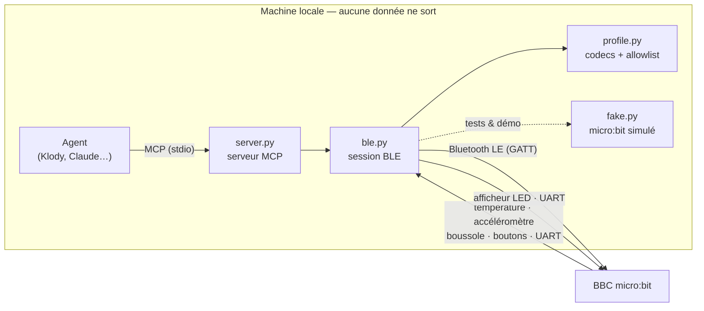
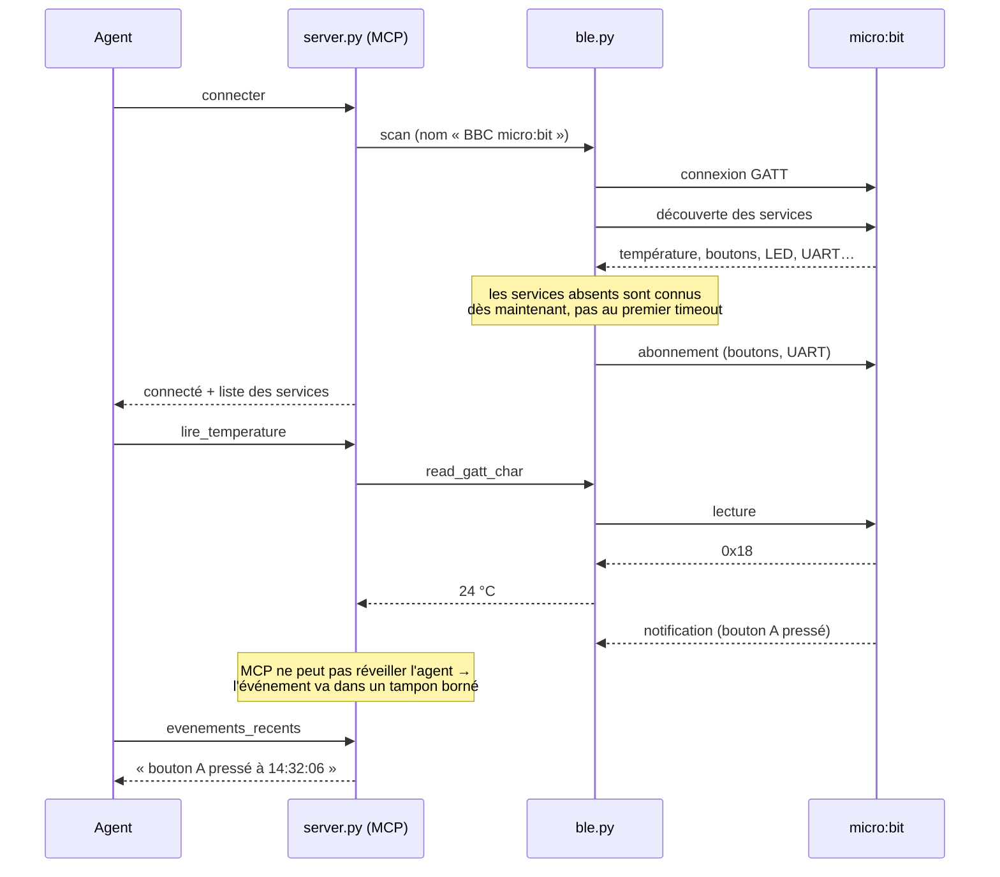

# micro:bit en Bluetooth — du matériel réel au bout de la boucle

> Connecter une carte **BBC micro:bit** en Bluetooth Low Energy, la lire, la
> piloter, et l'exposer en **MCP** pour qu'un agent local s'en serve.
> Code : [`microbit/`](../microbit/) · Mode d'emploi : [`microbit/README.md`](../microbit/README.md)

## Pourquoi cette brique

EdgeSense M0 démontrait la boucle **percevoir → décider → agir** avec un
capteur et un actionneur *simulés*. C'était le bon ordre — la logique d'abord —
mais une boucle qui ne touche rien de réel ne prouve pas grand-chose.

Le micro:bit est le pas suivant le moins cher qui soit : une carte à ~20 €, un
accéléromètre, une boussole, un thermomètre, deux boutons, un afficheur, et une
pile Bluetooth complète — le tout sans souder ni configurer de passerelle. De
quoi vérifier ce qui ne se vérifie qu'avec du matériel : la latence réelle, les
déconnexions, ce que coûte une écriture BLE, ce qui arrive quand la radio ment.

Et l'inversion intéressante : la carte est **capteur *et* actionneur**. La
boucle complète tient dans un seul appareil, à portée de radio.

## Comment c'est branché



Le découpage tient en une phrase : **`profile.py` ne connaît pas la radio**.
Tout le décodage d'octets y vit en bibliothèque standard pure, donc les 33
tests tournent sans `bleak`, sans dongle et sans carte. `ble.py` n'ajoute que
le transport, et accepte un client injecté — c'est ce qui rend `fake.py`
possible, et avec lui le développement sans matériel.

### Une connexion, de bout en bout



## Deux décisions de conception

**Une allowlist décide de ce qui peut être écrit.** Sept caractéristiques sont
inscriptibles, avec leurs bornes ; tout le reste est refusé *avant* d'atteindre
la radio. En tête de liste des refus : le service **DFU**, dont une écriture
déclencherait une reprogrammation à distance de la carte. C'est la même
discipline que l'allowlist d'actionneurs d'EdgeSense — sur du matériel, une
écriture non validée ne se rattrape pas.

**Le temps réel n'est pas maquillé.** MCP est requête/réponse : un serveur ne
peut pas réveiller l'agent quand un bouton est pressé. Plutôt que de prétendre
le contraire, le connecteur s'abonne aux notifications BLE dès la connexion et
les accumule dans un tampon borné que l'agent relève. C'est suffisant pour
« que s'est-il passé ? », insuffisant pour réagir en millisecondes. Ce verrou
reste le **risque n°1** de la feuille de route AIoT, et il se lèvera avec un
vrai bus pub/sub, pas avec MCP seul.

## Ce que le matériel apprend

Trois pièges du profil Bluetooth du micro:bit, chacun encodé et testé dans
`profile.py` — détails dans [le README du module](../microbit/README.md) :

1. **L'UART est inversé** par rapport à l'assignation Nordic habituelle : on
   écrit sur `…0003`, on écoute sur `…0002`.
2. **`UART TX` fonctionne en `indicate`, pas en `notify`** — CCCD `0x0200`.
   Forcer « notify » ne donne jamais aucune donnée.
3. **Un service absent n'est pas une panne radio**, c'est un firmware sans le
   service : le connecteur renvoie le bloc MakeCode à activer plutôt qu'un
   timeout opaque.

Et deux limites à connaître avant de bâtir dessus :

- **La température est celle du processeur**, pas de la pièce : elle lit
  quelques degrés au-dessus de l'ambiante. Bonne pour une tendance, pas pour
  une mesure d'ambiance.
- **20 octets par écriture** (MTU − 3) : au-delà, il faut fragmenter. Le
  connecteur réassemble les lignes reçues, mais refuse d'envoyer plus long
  plutôt que de tronquer en silence.

## Place dans la feuille de route

| Jalon | État |
|---|---|
| **M0** — boucle percevoir/décider/agir, capteur et actionneur simulés | ✅ codé |
| **M1** — matériel réel : **micro:bit en Bluetooth** | ✅ cette brique |
| **M1+** — capteurs filaires (DHT22/BME280 + relais sur Raspberry Pi), cache SQLite | conception |
| **M2** — temps réel : bus pub/sub, réaction à seuil | conception — *risque n°1* |
| **M3** — sécurité : bornes, journal signé, reconnexion | conception |
| **M4** — multi-nœuds : plusieurs cartes vers une passerelle | conception |

La suite naturelle est **M2** : plusieurs micro:bit qui poussent leurs mesures
vers une passerelle, sans qu'un agent ait à les interroger — c'est là que se
joue la promesse d'une domotique agentique locale (`HomePilot`).

## Essayer

```bash
python3 -m microbit.demo --simule boucle --consigne 24   # sans matériel
python3 -m unittest microbit.test_microbit -v            # 33 tests
```

Avec une carte : flasher un programme MakeCode qui démarre les services
Bluetooth, puis `python3 -m microbit.demo scan`. La marche à suivre complète,
et les pannes courantes, sont dans [`microbit/README.md`](../microbit/README.md).

---

*Référence : [BBC micro:bit Bluetooth Profile](https://lancaster-university.github.io/microbit-docs/resources/bluetooth/bluetooth_profile.html), Lancaster University.*
