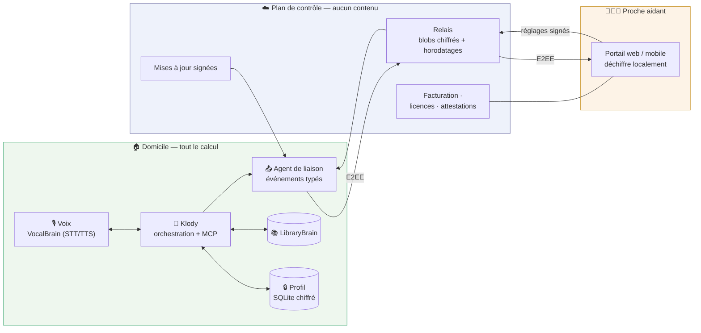

# SilverBrain — dossier SaaS

> **Thèse.** SilverBrain est le seul projet du portfolio dont l'utilisateur et le
> **payeur** sont deux personnes différentes — et c'est précisément ce qui en fait
> un produit à revenu récurrent, là où les autres restent des briques techniques.
> Le modèle n'est pas un SaaS classique : c'est un **abonnement à calcul local avec
> plan de contrôle distant**. Le cloud ne voit jamais ce que la personne dit ; il ne
> transporte que ce dont le proche a besoin pour être rassuré à distance.

Vue d'ensemble du concept : [SILVERBRAIN.md](SILVERBRAIN.md) ·
Jalons : [SILVERBRAIN-ROADMAP.md](SILVERBRAIN-ROADMAP.md) ·
Profil : [SILVERBRAIN-PROFIL.md](SILVERBRAIN-PROFIL.md) ·
Connecteurs : [SILVERBRAIN-MCP.md](SILVERBRAIN-MCP.md)

> ⚠️ **Statut du document.** Analyse et hypothèses de travail, pas un business plan
> validé. Les chiffres marché sont sourcés (§3, §11) ; **tous les chiffres de coûts,
> de prix et de marge sont des hypothèses à confronter au réel** (§10) et sont
> marqués comme tels. Rien ici n'est engagé tant que les portes de validation du
> §13 ne sont pas franchies.

---

## 1. Pourquoi SilverBrain, et pas un autre projet du portfolio

| Critère | SilverBrain | Klody Code AI | EdgeSense/TinyGuard | Dream × World |
|---|---|---|---|---|
| Payeur distinct de l'utilisateur | ✅ la famille paie pour le parent | ❌ | ~ (l'exploitant) | ❌ |
| Récurrence naturelle | ✅ service continu | ~ (licence) | ✅ supervision | ❌ |
| Valeur perçue sans culture technique | ✅ | ❌ | ❌ | ~ |
| Besoin **structurel** d'un accès distant | ✅ le proche est ailleurs | ❌ | ✅ | ❌ |
| Concurrence directe | modérée | brutale | fragmentée | quasi nulle (marché aussi) |
| Maturité aujourd'hui | concept + maquettes | produit (699 tests) | M0 simulé | moteur |

Le point décisif est la ligne 4. Un produit local-first n'a **aucune raison légitime**
d'avoir un serveur — sauf quand la personne à qui l'on rend des comptes n'est pas dans
la pièce. SilverBrain est le seul projet où le distant est un **besoin de l'usage**, pas
une facilité d'architecture. C'est ce qui rend le modèle défendable sans se renier.

---

## 2. Le paradoxe local-first × SaaS, et sa résolution

Le discours du portfolio est « aucune donnée ne quitte la machine ». Un SaaS classique
serait un reniement. La résolution tient en une règle : **le serveur est un plan de
contrôle, jamais un plan de données.**

### Ce qui monte, ce qui ne monte jamais

| Monte au serveur | Ne quitte **jamais** la box |
|---|---|
| État d'abonnement, facturation | Audio, quel qu'il soit |
| Santé technique (box en ligne, micro OK, version) | Transcriptions de conversation |
| Événements **typés** chiffrés de bout en bout : `rappel_confirme`, `rappel_manque`, `silence_36h` | Le profil (`traits`, `preuves`, citations — cf. [PROFIL](SILVERBRAIN-PROFIL.md) §2) |
| Consentements et périmètre de partage | Tout trait `sensibilite: "sensible"` (santé, deuil, finances) |
| Paquets de mise à jour signés (descendants) | Le contenu des messages et des lectures |

Les événements eux-mêmes sont **chiffrés de bout en bout** entre la box et l'application
du proche : le serveur route un blob opaque et un horodatage. Il connaît la *fréquence*
des événements, pas leur nature. C'est une limite honnête à annoncer : les métadonnées
de volume ne sont pas cachées.

### La ligne rouge éthique

Un produit qui informe un proche sur une personne âgée peut très vite devenir un
**mouchard**. Trois règles non négociables, qui découlent déjà de la spec profil :

1. **Le senior sait et consent.** Le portail aidant s'active par un accord explicite,
   redemandé périodiquement, et la personne peut le couper — c'est *son* assistant.
2. **Résumé bienveillant, jamais surveillance.** Le proche voit des *événements de
   vie* (« le rappel du matin a été confirmé »), pas un journal de conversation.
   Les traits sensibles n'apparaissent pas sans accord distinct ([PROFIL](SILVERBRAIN-PROFIL.md) §6).
3. **Symétrie.** La personne peut voir, à l'oral, ce que son proche voit d'elle.

Ce n'est pas de la morale décorative : c'est le seul moyen d'obtenir l'adhésion de
l'utilisateur final, sans laquelle le produit est désinstallé au bout de trois semaines
quel que soit le payeur.

---

## 3. Le marché, en chiffres vérifiables

- **Le choc démographique est maintenant.** 2026 marque l'entrée des premiers
  baby-boomers dans la tranche 80-85 ans, avec près de 200 000 personnes
  supplémentaires sur la seule année ; les 75-84 ans passent de 4,1 M (2020) à
  6 M (2030). ([silvereco.fr](https://www.silvereco.fr/residences-seniors-une-offre-en-plein-essor-face-au-choc-demographique-a-venir/))
- **Le réflexe d'abonnement existe déjà.** Plus de **900 000 abonnés** à la
  téléassistance en France. ([autonomag.com](https://www.autonomag.com/marche-teleassistance-domotique-senior/))
- **Le prix de référence est connu.** Téléassistance classique : **15 à 30 €/mois**,
  jusqu'à 50 € avec détection de chute. ([santeseniors.fr](https://santeseniors.fr/teleassistance/teleassistance-senior/))
- **La fiscalité divise la facture par deux.** Prestée par un organisme **agréé
  services à la personne**, la téléassistance ouvre droit au **crédit d'impôt de 50 %**,
  y compris pour les non-imposables ; elle est finançable par l'**APA** (GIR 1-4) et
  par des aides de caisses de retraite (CARSAT, MSA).
  ([filien.com](https://www.filien.com/infos-conseils/aides-et-tarifs/credit-impot-teleassistance/))
- **Le canal collectif est constitué.** 1 338 résidences services seniors et
  **108 286 logements** fin 2025, un parc qui a plus que doublé depuis 2017.
  ([logement-seniors.com](https://www.logement-seniors.com/actualites/residences-seniors-france-108000-logements-choc-demographique-2026.html))

**Ce que ces chiffres prouvent, et ce qu'ils ne prouvent pas.** Ils prouvent qu'un
abonnement mensuel autour de 25 € pour un service de maintien à domicile est un
comportement d'achat **établi**, avec un rail de financement public. Ils ne prouvent
pas qu'on paiera pour *celui-ci* : la téléassistance vend une garantie en cas de chute,
SilverBrain vend une présence quotidienne. Ce n'est pas le même achat émotionnel — c'est
l'objet de la porte n°1 (§13).

---

## 4. Qui paie — trois segments, dans cet ordre

### A. B2C indirect — la famille (segment d'amorçage)

L'enfant de 50-65 ans, à distance, qui vit la culpabilité comme moteur d'achat. Il
achète *pour son parent* mais **paie et configure lui-même** — ce qui correspond
exactement au jalon 4 : « un proche paramètre, le senior ne règle rien ».

- Décision rapide, cycle de vente court, feedback direct.
- Volume difficile à faire croître : acquisition unitaire coûteuse.
- **Rôle réel : valider le produit et le prix**, pas construire le chiffre d'affaires.

### B. B2B2C — résidences services, SAAD, bailleurs sociaux (segment de croissance)

108 000 logements en résidences services, plus les services d'aide à domicile. Ici le
modèle change de nature, et **mieux** :

- L'exploitant achète le matériel en **CAPEX** (ou le loue) — le problème n°1 de
  l'économie unitaire (§10) disparaît.
- Son personnel absorbe le **support de niveau 1**, second poste de coût.
- Une signature = 30 à 150 logements, pas un foyer.
- En échange : cycle de vente de 6-12 mois, appels d'offres, exigences d'intégration.

### C. B2G / institutionnel — CCAS, départements, conférences des financeurs

Le précédent existe et il est documenté : l'**Office for the Aging de l'État de New York
a distribué plus de 800 unités ElliQ** à des seniors dans le cadre d'un programme
financé publiquement. ([spectrumlocalnews.com](https://spectrumlocalnews.com/us/snplus/your-mental-health/2026/05/15/ai-companions-for-older-adults-))
En France, l'équivalent passe par l'APA, la conférence des financeurs et les CCAS.
Cycle très long, mais c'est le segment où l'argument « les données ne sortent pas »
cesse d'être un avantage marketing pour devenir une **condition d'éligibilité**.

> **Ordre recommandé : A pour apprendre, B pour vivre, C pour changer d'échelle.**
> Attaquer C d'abord est la façon classique de mourir de faim avec un excellent produit.

---

## 5. L'offre et les prix (hypothèses)

| Formule | Cible | Prix hypothèse | Après crédit d'impôt SAP 50 % |
|---|---|---|---|
| **Famille** | B2C | 29 €/mois + 149 € de mise en service, engagement 24 mois | **≈ 14,50 €/mois** |
| **Famille sans engagement** | B2C | 39 €/mois, matériel inclus, résiliable | ≈ 19,50 €/mois |
| **Résidence / SAAD** | B2B2C | 15 €/mois par logement, matériel acheté par l'exploitant, min. 25 unités | n/a (charge d'exploitation) |
| **Institutionnel** | B2G | licence par bénéficiaire + forfait déploiement et formation | financement APA / conférence des financeurs |

Trois remarques importantes :

- **L'agrément « services à la personne » n'est pas un détail administratif : c'est un
  levier de prix.** Il fait passer le prix ressenti de 29 € à 14,50 €, sous le prix
  d'une téléassistance de base. À qualifier tôt — l'éligibilité d'une prestation
  d'assistance vocale n'est pas acquise et doit être instruite, pas supposée.
- **Le matériel ne doit jamais être un achat visible en B2C.** « 149 € de mise en
  service » passe ; « 490 € de box » ne passe pas.
- **Pas de version gratuite.** Un public qui découvre l'outil n'évalue pas une offre :
  il l'adopte ou l'abandonne. Le bon équivalent du gratuit est un **essai de 30 jours
  avec installation accompagnée** et reprise du matériel.

---

## 6. Le produit distant : le portail aidant v1

C'est le composant qui *est* le SaaS. Il figure déjà comme « reste possible » dans la
mémoire du dépôt ; il devient ici le cœur commercial. Périmètre v1 :

1. **Fil de vie** — événements typés, chronologiques : rappel confirmé/manqué, appel
   passé, lecture faite, activité de la journée. Aucun contenu de conversation.
2. **Alertes configurables** — rappel important non confirmé après deux relances,
   silence anormal (> 36 h sans interaction), intention `détresse` détectée. C'est
   l'**escalade douce** du jalon 4, remontée au bon endroit.
3. **Carnet et connecteurs** — le proche déclare « ma fille Marie », active l'appel et
   le message, définit l'allowlist. Exactement le modèle de [SILVERBRAIN-MCP.md](SILVERBRAIN-MCP.md) §1.
4. **Rappels** — créer/modifier les routines (médicaments, rendez-vous) à distance.
5. **Santé de la box** — en ligne, micro fonctionnel, version, espace disque, dernière
   sauvegarde locale. C'est ce qui évite 80 % des appels au support.
6. **Multi-aidants avec rôles** — un aidant principal (paramètre), des aidants
   secondaires (lecture seule). La fratrie est la norme, pas l'exception.
7. **Compte et facturation** — attestation fiscale annuelle pour le crédit d'impôt,
   incluse et automatique.

Hors périmètre v1, volontairement : transcriptions, audio, géolocalisation, « score
cognitif ». Chacune de ces fonctions est demandée par les familles et chacune détruit
la relation de confiance avec l'utilisateur.

---

## 7. Architecture — calcul local, plan de contrôle distant

**Propriétés à tenir :**

- **La clé de déchiffrement des événements ne vit que sur la box et chez le proche**,
  échangée à l'appairage (QR code lors de l'installation). Le serveur ne peut pas
  déchiffrer, même sous réquisition — et doit pouvoir le prouver.
- **Dégradation propre.** Réseau coupé : l'assistant continue de fonctionner
  intégralement. Seuls le fil de vie et les alertes sont différés, puis rejoués.
  Un produit local-first qui cesse de fonctionner hors ligne n'en est pas un.
- **Rien de descendant n'est exécutable** sauf paquets de mise à jour signés et
  réglages signés par l'aidant appairé. La box n'accepte pas d'ordre du serveur.
- **Vérifiabilité.** Publier le protocole du relais et ouvrir le code de l'agent de
  liaison. Vendre la confidentialité sans permettre de la vérifier, c'est vendre une
  promesse ; le portfolio a la crédibilité technique pour faire mieux.

---

## 8. Conformité — à instruire avant de coder, pas après

| Sujet | Position visée | À faire |
|---|---|---|
| **RGPD — rôles** | La famille est responsable de traitement pour son foyer ; l'éditeur est **sous-traitant** limité au routage et à la facturation | Contrat de sous-traitance (art. 28), registre |
| **Minimisation** | Argument central : le contenu n'est jamais collecté | Documenter le modèle de données du relais |
| **AIPD / DPIA** | Probablement **obligatoire** : personnes vulnérables + données de santé implicites | Réaliser l'AIPD avant le premier déploiement payant |
| **Données de santé** | Les rappels de médicaments (`sante_routine`) en sont. Elles **restent sur la box** → pas d'hébergement de données de santé côté serveur | Le vérifier par conception ; ne jamais faire remonter le libellé d'un rappel de soin, seulement `rappel_confirme` |
| **Dispositif médical (MDR)** | **Rester hors champ** : pas de diagnostic, pas d'observance médicale, pas de détection de chute présentée comme sécurité vitale | Contrat de style et marketing alignés ; aucune promesse d'urgence |
| **AI Act** | Assistant grand public ; obligation de transparence (dire que c'est une IA) | Formulation explicite dès l'accueil, adaptée au public |
| **Accessibilité** | RGAA / EN 301 549 sur le portail aidant | Déjà l'esprit des maquettes `docs/ui/` |
| **Agrément SAP** | Condition du crédit d'impôt (§5) | Instruction juridique à mener tôt |

> Le point le plus dangereux du tableau est la ligne « dispositif médical ». La tentation
> commerciale sera énorme : « détecte les chutes », « surveille la prise de traitement »,
> « alerte en cas d'urgence ». Chacune de ces phrases déplace le produit vers un régime
> réglementaire, une responsabilité civile et une exigence de fiabilité 24/7 que ce
> projet n'a pas vocation à porter. **SilverBrain accompagne, il ne secourt pas.**

---

## 9. Ce qui reste à prouver techniquement

Le concept est documenté, le code ne l'est pas encore. Trois inconnues conditionnent
l'économie du produit :

1. **Quel matériel ?** Les performances revendiquées reposent sur MLX / Apple Silicon.
   Un Mac mini par foyer détruit l'économie unitaire ; une carte ARM à 300 € doit tenir
   STT + SLM + TTS avec une latence conversationnelle acceptable. **C'est le risque
   technique n°1, et il est chiffrable dès aujourd'hui** — c'est aussi le lien direct
   avec le travail EdgeSense sur les runtimes edge.
2. **La latence perçue.** Pour ce public, un blanc de 3 secondes est un échec
   d'interface, pas une lenteur. Budget cible à valider : < 1,2 s de la fin de parole
   au début de réponse.
3. **La robustesse en conditions réelles** — micro à 3 mètres, télévision allumée,
   voix âgée, prothèse auditive. Aucune de ces conditions n'est celle d'un test au
   bureau, et le jalon 5 est le seul endroit où elles apparaissent.

---

## 10. Économie unitaire (hypothèses à confronter)

> Toutes les valeurs ci-dessous sont des **hypothèses de travail**, à remplacer par des
> devis et des mesures. Elles servent à identifier le poste qui décide, pas à prédire.

| Poste | Hypothèse B2C | Hypothèse B2B2C |
|---|---|---|
| Matériel (BOM + boîtier + micro/HP) | 380 € | payé par l'exploitant |
| Logistique + mise en service | 60 € | 25 €/unité (déploiement groupé) |
| Relais + infra par foyer | 0,40 €/mois | 0,40 €/mois |
| **Support (poste dominant)** | 0,25 h/mois × 35 € = **8,75 €/mois** | ≈ 2 €/mois (N1 chez l'exploitant) |
| Revenu | 29 €/mois | 15 €/mois |
| **Marge brute mensuelle** | ≈ 19,85 € | ≈ 12,60 € |
| Récupération du matériel | ≈ 22 mois | immédiate |

**Ce que ce tableau dit, et c'est le point le plus important du document :**

- En **B2C direct, le matériel et le support mangent le modèle.** 22 mois de
  récupération sur un marché où le churn est structurellement élevé (§12) est trop
  long. D'où l'engagement 24 mois, les frais de mise en service, et surtout :
- **Le B2B2C n'est pas un segment secondaire, c'est le modèle viable.** Il supprime
  l'avance de matériel *et* divise le support par quatre. Le B2C sert à apprendre et à
  crédibiliser ; le B2B2C paie les salaires.
- **Le support est le vrai produit à concevoir.** Chaque heure de support économisée
  vaut plus que trois abonnements. C'est ce qui justifie que « santé de la box » soit
  au périmètre v1 du portail (§6.5), avant toute fonction séduisante.

Seuil indicatif : à 12,60 € de marge B2B2C et ~120 k€ de coûts fixes annuels
(une personne + infra + juridique), l'équilibre est autour de **800 logements actifs**,
soit 8 à 20 signatures d'exploitants. C'est atteignable ; ce n'est pas un projet
de six mois.

---

## 11. Concurrence

| Acteur | Ce qu'il fait | Faille exploitable |
|---|---|---|
| **Téléassistance** (900 k abonnés) | Bouton d'urgence, détection de chute | Ne fait rien **entre** les urgences — aucun usage quotidien, aucune conversation |
| **ElliQ** (Intuition Robotics) | Compagnon IA seniors : 249 $ + ~59 $/mois, déployé par des agences d'État US ([robotics247](https://www.robotics247.com/article/intuition_robotics_launches_elliq_companion_robot_us_subscription), [theseniorlist](https://www.theseniorlist.com/aging-in-place/elliq/)) | **Cloud, anglophone, US.** Prouve le prix et le canal public — sans occuper le terrain européen ni l'argument de confidentialité |
| **Alexa / Google** | Enceintes génériques, quasi gratuites | Conçues pour des gens à l'aise avec la technologie ; monétisation par la donnée — inacceptable pour ce public et ses proches |
| **Solutions EHPAD** | Logiciels métier institutionnels | Pensées pour l'établissement, pas pour la personne ; pas de domicile |

**Lecture stratégique.** ElliQ est la meilleure nouvelle du tableau : il valide le prix
(≈ 59 $/mois, très au-dessus de l'hypothèse à 29 €), l'appétence, et le financement
public — tout en étant structurellement cloud et anglophone. La position de SilverBrain
s'écrit alors en une phrase : **l'équivalent européen, francophone, dont les
conversations ne quittent pas le domicile.** Ce n'est pas un slogan, c'est la seule
chose qu'un concurrent américain ne peut pas copier sans refaire son architecture.

---

## 12. Risques, classés par ce qu'ils tuent

| # | Risque | Ce qu'il tue | Atténuation |
|---|---|---|---|
| 1 | **Le matériel local ne tient pas la latence à un coût acceptable** | le produit entier | Mesurer sur 3 cartes cibles **avant** le jalon 4 ; capitaliser sur EdgeSense |
| 2 | **Le senior refuse ou abandonne** malgré l'achat de la famille | le renouvellement | Jalon 5 sans tutoriel ; adhésion > conformité au cahier des charges |
| 3 | **Churn structurel** : décès, entrée en établissement, hospitalisation — 20-30 %/an, indépendant de la qualité | l'économie unitaire | B2B2C (le logement se réattribue), engagement, matériel réemployable |
| 4 | **Coût du support en B2C** | la marge | Portail « santé de la box », télédiagnostic, N1 délégué |
| 5 | **Dérive vers la surveillance** sous pression des familles | la confiance, puis le produit | Périmètre v1 verrouillé (§6), symétrie du regard (§2) |
| 6 | **Glissement réglementaire** vers le dispositif médical | l'entreprise | Discipline marketing, AIPD, avis juridique en amont |
| 7 | **Projet solo, produit à 24/7** | la tenue dans la durée | B2B2C d'abord (support mutualisé), pas de promesse d'urgence |

Le risque n°3 mérite d'être dit franchement parce qu'il est rarement anticipé : sur ce
marché, **on perd des clients pour des raisons qui n'ont rien à voir avec le produit**.
Tout modèle qui suppose 5 ans de durée de vie client est faux.

---

## 13. Plan de validation — trois portes avant d'écrire du code produit

Rien dans ce document ne justifie de développer le portail aidant aujourd'hui. Trois
portes, dans l'ordre, chacune avec un critère de sortie chiffré.

**Porte 1 — Le problème (2 à 3 semaines, coût ≈ 0).**
Dix entretiens avec des aidants familiaux (script en annexe). Aucune démonstration,
aucun pitch : on écoute ce qui les inquiète et ce qu'ils paient déjà.
→ *Passe si* ≥ 6 sur 10 décrivent spontanément le besoin d'un lien quotidien, et si
≥ 3 paient déjà quelque chose pour ce besoin.

**Porte 2 — Le prix (2 semaines).**
Une page d'offre publique avec les trois formules du §5 et un vrai formulaire de
pré-inscription (sans paiement). Trafic via LinkedIn et le Carnet, déjà en place.
→ *Passe si* le taux de pré-inscription est mesurable et qu'au moins 3 personnes
acceptent un appel de qualification en connaissant le prix.

**Porte 3 — Le pilote payant (3 mois).**
Un exploitant, 10 à 20 logements, tarif B2B2C, matériel fourni. C'est là que le jalon 5
de la roadmap (3 seniors réels) devient un pilote commercial au lieu d'un test utilisateur.
→ *Passe si* ≥ 60 % des résidents utilisent l'assistant chaque semaine au 3ᵉ mois et si
l'exploitant renouvelle.

**Avant la porte 1, une seule tâche technique est justifiée** : la mesure de latence et
de coût matériel du risque n°1 (§12). Elle est peu coûteuse et peut invalider le projet
à elle seule — donc elle passe en premier.

---

## 14. Ce que cela change dans la roadmap existante

La [feuille de route](SILVERBRAIN-ROADMAP.md) reste valable ; deux jalons changent
de statut :

- **Jalon 4 (interface aidant)** — cesse d'être une commodité d'usage pour devenir le
  **premier composant commercial**. À concevoir d'emblée avec appairage E2EE, rôles
  multi-aidants et santé de la box, même si la v0 reste locale sur le réseau du domicile.
- **Jalon 5 (3 seniors réels)** — devient la **porte 3**. Même protocole, mais avec une
  question ajoutée à la fin : « qu'est-ce que vous seriez prêt à payer, et qui devrait
  payer ? »

Un jalon **0** s'ajoute avant tout le reste : *banc matériel — STT + SLM + TTS sur trois
cibles, latence et coût mesurés*. Il ne figure pas dans la roadmap actuelle et c'est
sa lacune la plus sérieuse au regard d'une ambition produit.

---

## 15. Ce que je ne recommande pas

- **Un vrai SaaS cloud** (assistant hébergé, audio remonté). Techniquement plus simple,
  commercialement suicidaire : ce serait un ElliQ moins bon, sans son financement, et
  la fin de la cohérence du portfolio.
- **Le matériel propriétaire dessiné sur mesure.** Un boîtier industriel standard suffit ;
  concevoir du hardware ajoute 18 mois et un métier.
- **Le B2G en premier.** Le meilleur segment à terme, le pire pour commencer.
- **Mener ce produit et Klody Code AI de front à intensité égale.** Klody est le socle
  technique et la source de crédibilité (et de revenu par le conseil) ; SilverBrain est
  le pari produit. Les deux à 100 % en solo, non.

---

## Annexe — script d'entretien aidant (porte 1)

Questions ouvertes, dans cet ordre, sans jamais parler du produit avant la question 8 :

1. Racontez-moi votre dernière semaine avec votre père / votre mère.
2. Qu'est-ce qui vous inquiète le plus, concrètement ?
3. Comment savez-vous, aujourd'hui, que la journée s'est bien passée ?
4. Qu'est-ce que vous avez déjà essayé ? Qu'est-ce qui a été abandonné, et pourquoi ?
5. Qu'est-ce que vous payez aujourd'hui, tous services confondus ?
6. Qui décide, dans la fratrie ? Qui paie ?
7. Qu'est-ce que votre parent refuserait absolument ?
8. *(seulement ici)* Si une chose écoutait et parlait à la maison, sans jamais rien
   envoyer sur Internet, et vous disait « le rappel du matin a été confirmé » — qu'est-ce
   que ça changerait ? Qu'est-ce que ça vous ferait peur de perdre ?

Signal à chercher : la personne qui parle de **charge mentale** plutôt que de sécurité.
C'est elle qui paie 29 €/mois pour dormir tranquille — la sécurité, elle, est déjà
vendue par la téléassistance à 20 €.

---

## Sources

- [silvereco.fr — résidences seniors et choc démographique](https://www.silvereco.fr/residences-seniors-une-offre-en-plein-essor-face-au-choc-demographique-a-venir/)
- [logement-seniors.com — 108 000 logements en résidences services](https://www.logement-seniors.com/actualites/residences-seniors-france-108000-logements-choc-demographique-2026.html)
- [autonomag.com — marché téléassistance et domotique senior](https://www.autonomag.com/marche-teleassistance-domotique-senior/)
- [santeseniors.fr — prix de la téléassistance 2026](https://santeseniors.fr/teleassistance/teleassistance-senior/)
- [filien.com — crédit d'impôt téléassistance](https://www.filien.com/infos-conseils/aides-et-tarifs/credit-impot-teleassistance/)
- [robotics247 — ElliQ, disponibilité commerciale et abonnement](https://www.robotics247.com/article/intuition_robotics_launches_elliq_companion_robot_us_subscription)
- [theseniorlist.com — revue ElliQ, tarifs](https://www.theseniorlist.com/aging-in-place/elliq/)
- [spectrumlocalnews.com — déploiement public d'ElliQ (NY Office for the Aging)](https://spectrumlocalnews.com/us/snplus/your-mental-health/2026/05/15/ai-companions-for-older-adults-)

---

*Document de travail — hypothèses commerciales, pas engagements. À réviser après
chaque porte de validation (§13).*
