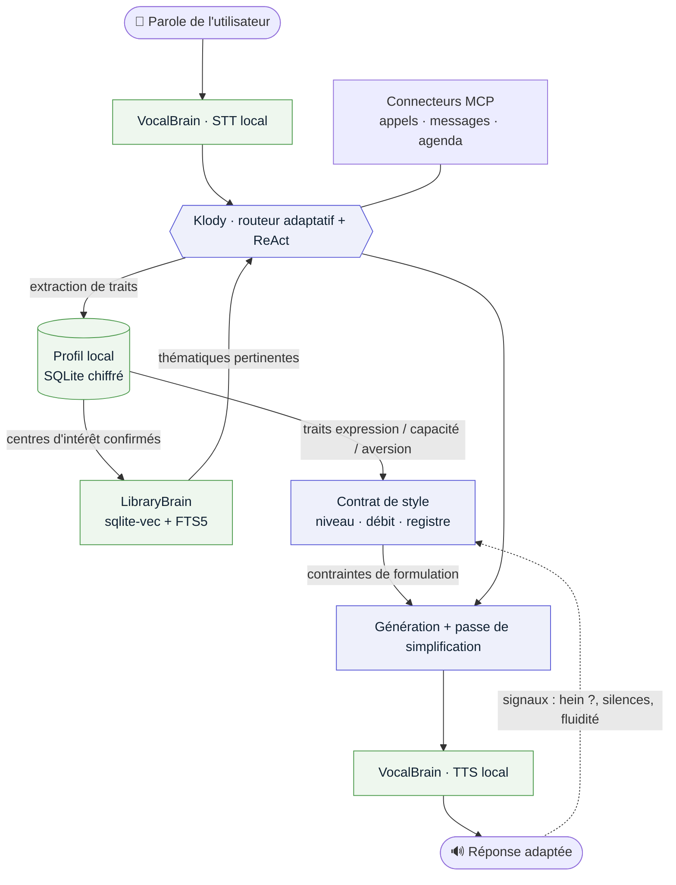

# SilverBrain — assistant IA intuitif pour un public réfractaire aux nouvelles technologies

> **IA 100 % locale, conçue pour être évidente à utiliser.** On lui parle
> naturellement, comme à une personne. Il apprend à connaître son utilisateur au fil de
> la conversation, l'oriente vers les sujets qui le concernent, l'accompagne au quotidien
> — et adapte toujours sa façon de parler à quelqu'un que la technologie intimide.

SilverBrain fait partie de la famille *Brain* (aux côtés de **LibraryBrain** et
**VocalBrain**) et réutilise l'infrastructure locale de **Klody Code AI** : modèles sur
l'appareil (MLX / Ollama), orchestration adaptative et exposition **MCP**. Aucune donnée
personnelle ne quitte la machine.

---

## 🎯 Pour qui, et pourquoi

Cible : les personnes que la technologie **rebute ou intimide** — souvent des seniors,
mais pas seulement. Pour elles, l'obstacle n'est pas le besoin (rappels, lecture, lien
avec les proches) mais **l'interface** : menus, comptes, jargon, peur de « mal faire ».

SilverBrain lève cet obstacle avec un principe unique : **il n'y a rien à apprendre.**
On parle, il comprend, il s'adapte.

---

## Les quatre piliers

Le produit tient sur quatre piliers. Les deux premiers (**intuitivité** et **profilage**)
sont le socle relationnel ; le troisième (**accompagnement**) est ce que l'assistant
*fait* ; le quatrième (**formulation adaptative**) est ce qui rend les trois autres
réellement accessibles.

---

## 1. 🧠 Intuitif — le langage naturel, rien d'autre

**Principe.** Aucune commande à mémoriser, aucun mot-clé magique, aucun « menu ».
L'utilisateur formule sa demande comme il la dirait à un proche. L'assistant a la charge
de comprendre — jamais l'inverse.

**Comment concrètement.**

- **Toujours à l'écoute, sans « mot de réveil » à apprendre.** Un geste physique simple
  (un gros bouton unique, ou une phrase d'appel choisie *par l'utilisateur* lors du
  profilage, ex. son prénom) démarre l'échange. Rien de technique à retenir.
- **Compréhension par intention, pas par formule.** Klody classe la demande
  (easy/medium/hard × type) et la mappe sur une *intention* : `rappel`, `lecture`,
  `appeler_un_proche`, `raconter/souvenir`, `question_simple`, `détresse`. « Je ne sais
  plus si j'ai pris mon comprimé », « est-ce que j'ai pris mon cachet ? » et « mon
  médicament de ce matin ? » aboutissent à la même intention.
- **Réparation douce plutôt qu'erreur.** Si la confiance est basse, l'assistant **ne
  bloque pas** : il propose l'interprétation la plus probable sous forme de question
  fermée. « Vous voulez dire *votre comprimé du matin* — c'est bien ça ? »
- **Confirmation avant toute action qui engage.** Appeler, envoyer un message, supprimer
  un rappel → une confirmation orale claire, une seule à la fois.
- **Mémoire de la conversation.** Les références implicites sont résolues : après « lis-moi
  la lettre de la mairie », un simple « et la deuxième page ? » reste dans le contexte.

**Exemple de dialogue.**

```
— Dis donc, je crois que j'ai oublié quelque chose ce matin…
— Voulez-vous que je vérifie vos rappels de la matinée ?         (question fermée)
— Oui.
— Ce matin, il y avait votre comprimé pour la tension. Voulez-vous
  que je le note comme pris, ou vous le rappeler plus tard ?
```

**Choix de conception.** Le coût d'une incompréhension est asymétrique : pour ce public,
un faux blocage (« commande non reconnue ») est bien plus décourageant qu'une question de
clarification. SilverBrain **préfère toujours reformuler que refuser**.

---

## 2. 🧭 Profilage conversationnel — connaître pour orienter

**Principe.** L'assistant construit, **en langage naturel et en continu**, un portrait de
la personne : centres d'intérêt, rythme de vie, proches, préférences d'expression. Ce
profil sert deux choses — **quoi** proposer (thématiques LibraryBrain) et **comment** le
dire (formulation, pilier 4).

**Comment concrètement.**

- **Pas de questionnaire.** Le profil émerge de la conversation. Quand la personne
  raconte « mon mari cultivait des tomates », l'assistant en déduit doucement un intérêt
  possible (*jardinage*) — sans interroger, et **en le confirmant avant de s'en servir**.
- **Un profil lisible, éditable, local.** Stocké en **SQLite chiffré au repos** sous forme
  de *traits* simples et révisables :

  ```
  centre_intérêt : jardinage        (confiance 0.8, vu 4×, dernière fois : hier)
  centre_intérêt : histoire locale  (confiance 0.6, vu 2×)
  rythme          : lève-tôt, sieste après déjeuner
  proche          : Marie (fille) — appels fréquents
  expression      : préfère le vouvoiement, phrases courtes
  ```

  Chaque trait a une **confiance**, une **fraîcheur** et une **source** ; rien n'est figé,
  tout se corrige à l'oral (« non, je ne jardine plus »).
- **Orientation vers les thématiques LibraryBrain.** Les traits « centre d'intérêt »
  deviennent des **requêtes vers LibraryBrain** (recherche hybride sqlite-vec + FTS5) qui
  remontent des lectures, sujets et souvenirs *réellement pertinents*, au lieu d'un
  catalogue générique. Le profil agit comme un **filtre et un classeur** de la
  bibliothèque personnelle.
- **Consentement et transparence, à voix haute.** « J'ai remarqué que vous aimez parler
  jardinage — je vous proposerai des lectures là-dessus, d'accord ? » L'utilisateur garde
  la main : il peut oublier un sujet d'un mot.
- **Démarrage en douceur (cold start).** Aux premiers jours, sans profil, l'assistant
  reste utile (rappels, lecture) et propose **quelques thématiques larges** pour amorcer,
  sans jamais ressembler à un formulaire d'inscription.

**Boucle de fonctionnement.**

```
conversation ──► extraction de traits ──► profil (SQLite local)
      ▲                                        │
      │                                        ▼
  reformulation                    requêtes LibraryBrain (thématiques)
  adaptée (pilier 4) ◄──────────── proposition confirmée à l'utilisateur
```

**Choix de conception.** Le profil n'est pas un outil de ciblage mais un outil de
**pertinence et de dignité** : il évite de noyer la personne sous des options, et permet
à l'assistant de parler *de ce qui la concerne*. Il vit **entièrement en local** — c'est
ce qui rend acceptable un profilage aussi personnel.

> 📐 Le modèle de données complet du profil (schéma des traits, confiance & oubli, pipeline
> d'extraction, consentement, sécurité) est spécifié dans
> [**SILVERBRAIN-PROFIL.md**](SILVERBRAIN-PROFIL.md).

---

## 3. 📅 Accompagnement au quotidien — ce que l'assistant fait

**Principe.** Sur le socle *intuitivité + profil*, l'assistant rend des services concrets,
chacun déclenché en langage naturel et informé par le profil.

- 💊 **Rappels intelligents.**
  - Créés à l'oral (« rappelle-moi mes gouttes à 18 h »), **proposés proactivement** à
    partir du profil et du rythme détecté (ex. rappel calé après la sieste plutôt qu'à une
    heure fixe abstraite).
  - **Escalade douce** : si un rappel important (médicament) n'est pas confirmé, l'assistant
    represente calmement, puis — si configuré — prévient un proche. Jamais d'alarme
    anxiogène.
  - Stockés localement (SQLite), fonctionnent **hors-ligne**.

- 📖 **Aide à la lecture & à la mémoire (moteur LibraryBrain).**
  - **Lecture à voix haute** de courriers, documents, ordonnances (numérisés/importés
    localement), avec **résumé en une phrase** avant le détail (« C'est un courrier de la
    mairie au sujet de vos impôts locaux. Je vous lis l'essentiel ? »).
  - **Aide-mémoire** : « où ai-je rangé mes papiers de mutuelle ? », « quand Marie
    doit-elle passer ? » — réponses puisées dans la mémoire personnelle indexée.
  - **Fil de souvenirs thématique** : à partir des centres d'intérêt, propose lectures et
    échanges (histoire locale, recettes, photos annotées) — lutte douce contre l'isolement.

- 📞 **Lien avec les proches.**
  - « Appelle ma fille », « envoie un message à Paul » via des **connecteurs MCP** activés
    et paramétrés par la famille (le senior n'a aucun réglage à faire).
  - Carnet de contacts nommé en clair (« ma fille », « le docteur »), résolu depuis le
    profil.

- ➕ **« … et plus » — un socle extensible.**
  Le trio **profil + LibraryBrain + MCP** est une plateforme, pas une liste figée. Pistes
  proposées, activables une par une sans complexifier l'usage :
  - **Journal de bien-être vocal** (humeur, sommeil) → synthèse pour un proche/médecin de
    confiance, localement.
  - **Assistant administratif** : comprendre un courrier officiel et proposer la prochaine
    étape.
  - **Rituels** : revue du soir, agenda du lendemain lu à voix haute.
  - **Photos parlantes** : reconnaître et raconter des photos de famille annotées.

---

## 4. 🗣️ Formulation adaptative — rendre tout cela réellement accessible

**Principe.** C'est le pilier différenciant. SilverBrain **tient compte des contraintes
d'un public réfractaire à la technologie** et ajuste *comment* il parle — pas seulement
*ce qu'il dit*. La même information n'est pas formulée pareil pour tout le monde.

**Les leviers d'adaptation.**

- **Vocabulaire.** Zéro jargon (« application », « synchroniser », « paramètres »
  bannis). On dit « je note », pas « j'enregistre dans la base ».
- **Longueur & structure.** Phrases courtes, **une idée à la fois**, jamais de liste de
  plus de deux options à l'oral.
- **Rythme & répétition.** Débit réglable ; répétition **sans impatience** ; sur
  incompréhension, l'assistant **redit autrement** (paraphrase) plutôt que mot pour mot.
- **Ton rassurant & déculpabilisant.** Pas d'« erreur », pas de « vous avez mal fait » :
  toujours une reformulation. Le message implicite constant : *il n'y a pas de mauvaise
  façon de me parler.*
- **Registre issu du profil.** Vouvoiement/tutoiement, prénom, formules familières :
  alignés sur le trait `expression` détecté au pilier 2.

**Mise en œuvre proposée.**

- Un **« contrat de style »** dérivé du profil (niveau de simplicité, débit, registre,
  longueur max) est injecté à chaque génération comme contraintes système — le même moteur
  Klody, mais **sous une enveloppe de style** paramétrée par personne.
- **Modèle à deux passes** pour les messages importants : génération du contenu, puis
  passe de **simplification/vérification de lisibilité** (longueur, jargon, une-idée-à-la-
  fois) avant énoncé — dans l'esprit du *Best-of-N* déjà utilisé dans le portfolio.
- **Boucle de calibrage implicite.** Les signaux d'incompréhension (« hein ? », « répète »,
  silences, demandes de répétition) **ajustent automatiquement** le contrat de style vers
  plus de simplicité/lenteur, et inversement si tout est fluide.

**Exemple — même information, deux formulations.**

```
Profil « à l'aise » :
  « Votre rendez-vous chez le Dr Martin est déplacé à jeudi 15 h. Je mets à jour ? »

Profil « réfractaire / intimidé » :
  « J'ai une nouvelle pour votre rendez-vous chez le docteur.
    … Il est maintenant jeudi, à trois heures de l'après-midi.
    Voulez-vous que je le note ? »
```

**Choix de conception.** L'accessibilité n'est pas un thème visuel mais une **propriété
du langage**. En traitant le style comme une contrainte de première classe (et non un
réglage caché), SilverBrain reste utilisable par la personne qui, précisément, ne
toucherait jamais à un réglage.

> 📐 Le catalogue complet des règles du contrat de style (les quatre niveaux, les
> transformations avant/après, la boucle de calibrage) est détaillé dans
> [**SILVERBRAIN-STYLE.md**](SILVERBRAIN-STYLE.md).

---

## 🌅 Une journée avec SilverBrain (scénario de bout en bout)

*Jeanne, 78 ans, vit seule. Elle n'a jamais aimé « les machines ». Sa fille Marie a
installé SilverBrain sur un petit boîtier posé dans le salon. Voici une journée — chaque
échange met en jeu les quatre piliers.*

**8 h 10 — le réveil en douceur** *(pilier 3 : rappel · pilier 4 : formulation)*
```
SilverBrain — Bonjour Jeanne. … Ce matin, il y a votre comprimé pour la tension.
              Voulez-vous que je vous le rappelle maintenant, ou après le café ?
Jeanne      — Oh, après le café.
SilverBrain — C'est noté. Je vous le redis dans un moment.
```
> Le rappel est calé sur son `rythme` (lève-tôt, café d'abord), la phrase est courte et
> propose **une seule** décision.

**9 h 30 — un courrier qui inquiète** *(pilier 1 : intention · pilier 3 : lecture)*
```
Jeanne      — J'ai reçu une lettre, je n'y comprends rien…
SilverBrain — Voulez-vous que je vous la lise ? Posez-la à plat, je regarde.
              … C'est un courrier de la mairie au sujet de vos impôts locaux.
              En un mot : ils confirment une réduction. Je vous lis le détail ?
Jeanne      — Juste l'essentiel.
SilverBrain — Vous n'avez rien à faire, et vous paierez moins que l'an dernier.
```
> Comprension **par intention** (« je n'y comprends rien » → lecture + résumé), **résumé
> en une phrase** avant le détail, ton rassurant.

**11 h 00 — une confidence, donc un trait** *(pilier 2 : profilage)*
```
Jeanne      — Mon mari, lui, il passait ses matinées au jardin. Les tomates…
SilverBrain — (n'interrompt pas ; enregistre un trait candidat)
              centre_interet:jardinage — source:inference, consentement:propose
```
> Rien n'est imposé : le trait reste en **`propose`** tant qu'il n'est pas confirmé
> (voir [SILVERBRAIN-PROFIL.md](SILVERBRAIN-PROFIL.md)).

**15 h 00 — l'orientation thématique** *(pilier 2 → 3 : LibraryBrain)*
```
SilverBrain — Vous m'avez parlé du jardin de votre mari. Si vous voulez, je peux
              vous lire de temps en temps de petites choses sur le jardinage —
              d'accord ?
Jeanne      — Ah oui, ça me plairait.
SilverBrain — (le trait passe à consentement:confirme)
              Alors écoutez : c'est bientôt la saison pour tailler les rosiers…
```
> Le profil **confirmé** déclenche une requête **LibraryBrain** vers des thématiques qui
> la concernent vraiment — pas un catalogue générique.

**18 h 00 — garder le lien** *(pilier 1 : intention · pilier 3 : MCP · confirmation)*
```
Jeanne      — Je voudrais dire bonsoir à Marie.
SilverBrain — Vous voulez appeler votre fille Marie ? … Je l'appelle ?
Jeanne      — Oui.
SilverBrain — J'appelle Marie.        (connecteur MCP activé par Marie ; confirmation avant l'action)
```

**21 h 30 — le calibrage silencieux** *(pilier 4 : boucle d'adaptation)*
```
SilverBrain — Demain, votre rendez-vous chez le podologue est à…
Jeanne      — Hein ? Répète ?
SilverBrain — (signal d'incompréhension → le contrat de style se simplifie et ralentit)
              Demain… vous voyez le podologue. … À dix heures, le matin.
              Voulez-vous que je vous le rappelle au réveil ?
Jeanne      — Oui, merci.
```
> Le « hein ? » ajuste **automatiquement** la formulation vers plus de simplicité et de
> lenteur, sans que personne ne touche à un réglage.

**Le lendemain, côté Marie — la confiance** *(accessibilité & confiance)*
> Depuis son téléphone, Marie voit un résumé bienveillant (rappels tenus, ton d'humeur),
> **jamais les sujets sensibles** sans accord distinct de Jeanne. Tout est resté **sur le
> boîtier, en local** — rien n'est parti dans le cloud.

---

## 🏗️ Architecture (réutilise l'existant)

```
Voix ──► VocalBrain (STT/TTS local) ──► Klody (routeur adaptatif + boucle ReAct)
                                              │
        ┌─────────────────┬───────────────────┼───────────────────┐
        ▼                 ▼                    ▼                   ▼
   Profil user      LibraryBrain         Connecteurs MCP     Rappels / agenda
 (local, SQLite)  (thématiques,        (appels, messages)    (local, SQLite)
                  lecture, résumés)
        │                                                          
        ├──► oriente le choix des thématiques (pilier 2 → 3)       
        └──► alimente le « contrat de style » de la formulation (pilier 4)
```

- **Entrée / sortie** : STT + TTS locaux (VocalBrain) — la voix ne quitte jamais
  l'appareil.
- **Cerveau** : routeur adaptatif de Klody (easy/medium/hard) ; le **profil** conditionne
  **le choix des thématiques LibraryBrain** *et* **le style de formulation**.
- **Mémoire du profil** : préférences et centres d'intérêt en **SQLite chiffré au repos**,
  construits en langage naturel, jamais via un formulaire.
- **Actions** : exposées via **MCP** — la famille active uniquement les connecteurs
  souhaités, chacun avec confirmation.

### Flux profil → thématiques → formulation

Le profil est le pivot : il décide **quoi** proposer (via LibraryBrain) *et* **comment** le
dire (via le contrat de style).



La boucle en pointillés est le **calibrage** (pilier 4) : la réaction de l'utilisateur
ajuste le contrat de style pour l'énoncé suivant. Tout le graphe s'exécute **en local**.

---

## ♿ Accessibilité & confiance

- **Zéro configuration visible** — pas de comptes, pas de mots de passe, pas de mise à
  jour à gérer.
- **Confirmation systématique** avant tout appel, message ou action irréversible.
- **Interface secondaire « gros boutons »** (Tauri 2 + React, fort contraste) pour un
  proche aidant, sans jamais imposer l'écran à l'utilisateur.
- **Paramétrage possible par un proche de confiance** (avec accord de l'utilisateur),
  localement, sans exposer les données à un tiers ni au cloud.
- **Fonctionne hors-ligne** — aucune donnée ne transite.

---

## 🗺️ Statut & prochaines étapes

Concept / exploration au sein du portfolio IA locale. Les briques réutilisées
(VocalBrain, LibraryBrain, Klody, MCP) sont décrites dans le
[README principal](../README.md).

Jalons envisagés :
1. **Socle vocal + intentions** (piliers 1 & 3 de base) sur VocalBrain + Klody.
2. **Profil local + orientation LibraryBrain** (pilier 2) — voir [SILVERBRAIN-PROFIL.md](SILVERBRAIN-PROFIL.md).
3. **Contrat de style + boucle de calibrage** (pilier 4) — voir [SILVERBRAIN-STYLE.md](SILVERBRAIN-STYLE.md).
4. **Connecteurs MCP proches** et interface aidant « gros boutons ».

### 📚 Documentation
- [SILVERBRAIN.md](SILVERBRAIN.md) — concept, 4 piliers, scénario, architecture *(ce fichier)*
- [SILVERBRAIN-PROFIL.md](SILVERBRAIN-PROFIL.md) — modèle de données du profil
- [SILVERBRAIN-STYLE.md](SILVERBRAIN-STYLE.md) — catalogue du contrat de style
- [SILVERBRAIN-MCP.md](SILVERBRAIN-MCP.md) — connecteurs MCP (appels, messages, agenda)

### 🎨 Maquettes
- [ui/landing.html](ui/landing.html) — page de présentation publique
- [ui/ecran-accessible.html](ui/ecran-accessible.html) — écran « gros boutons » voix-d'abord
