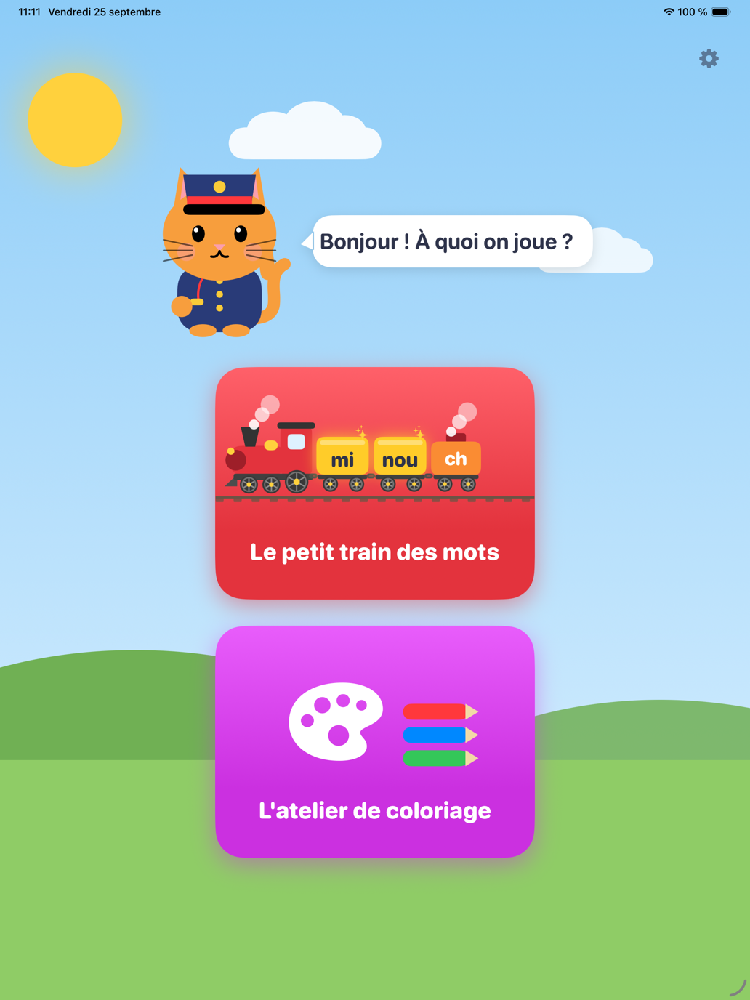
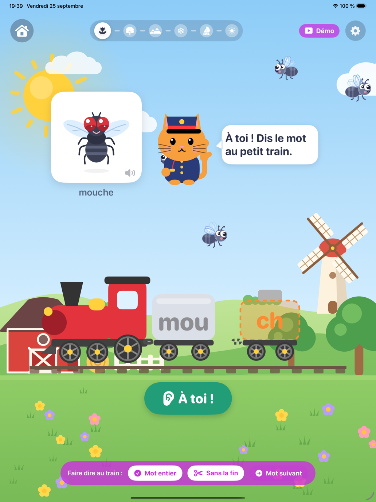
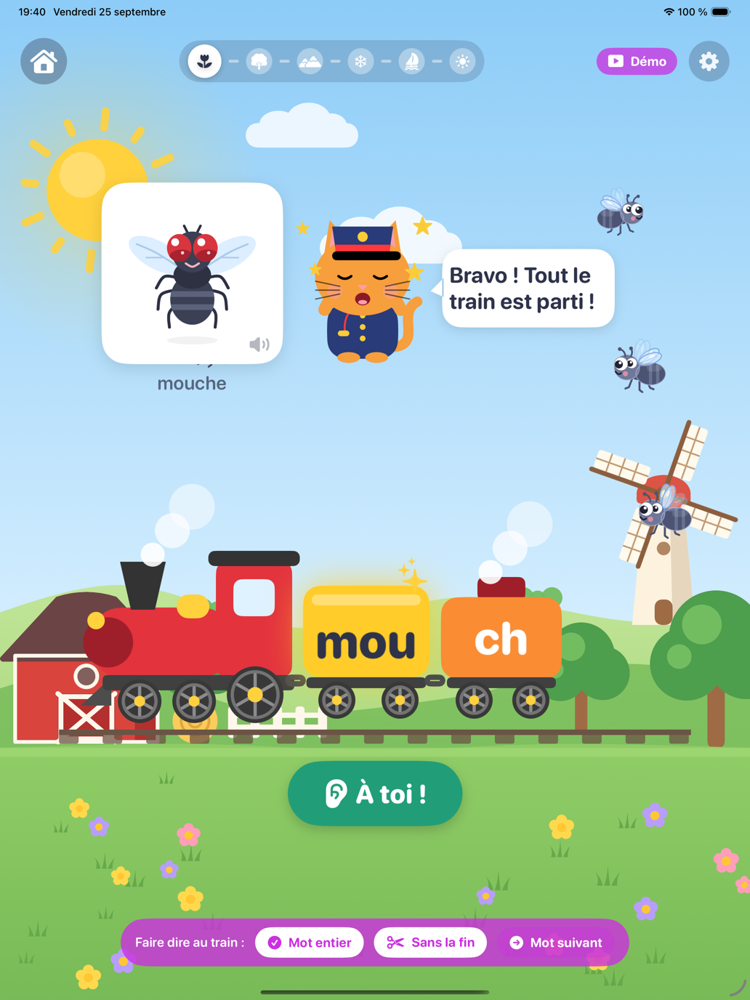
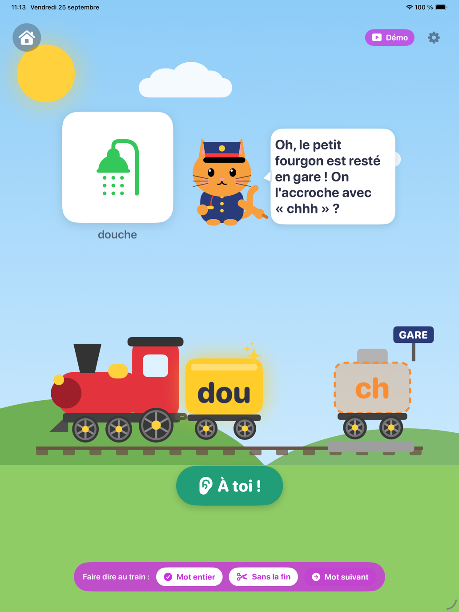
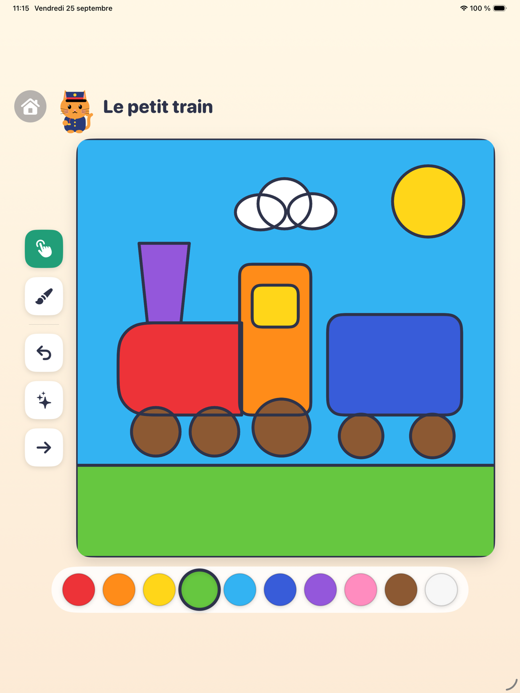
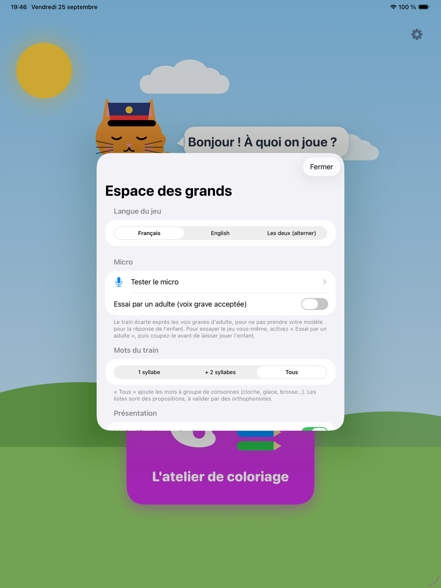
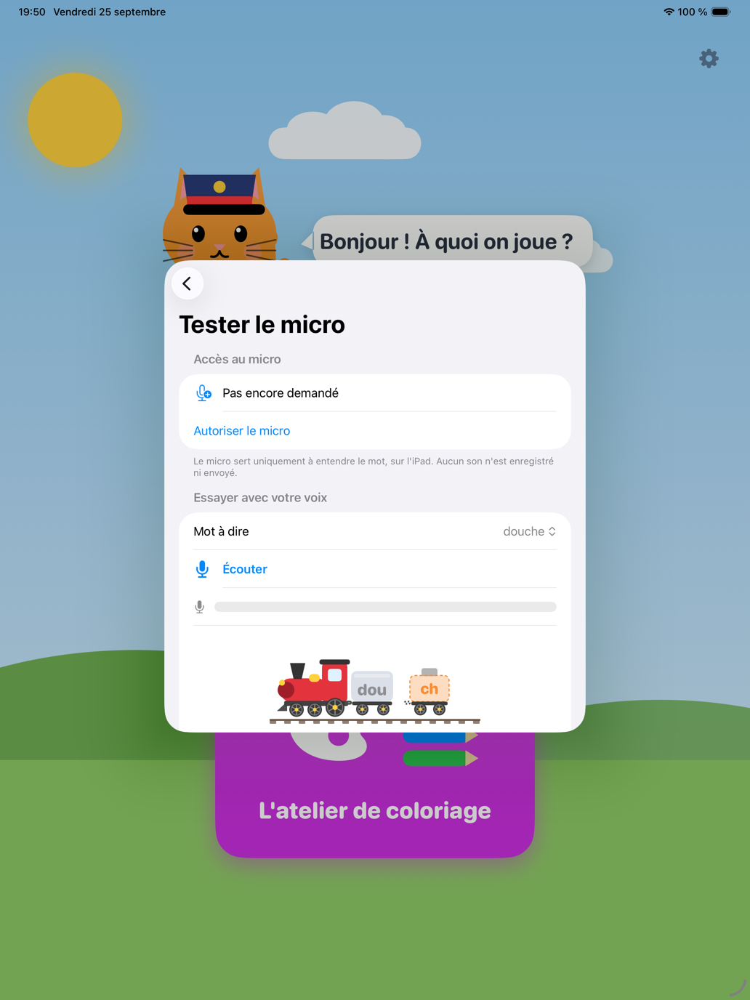

# `eveil/` — Suite Éveil : le Petit Train des mots (iPad, 3 ans et +)

Le code de l'app 1 de la [Suite Éveil](../docs/EVEIL.md) : un petit train dont les **wagons
s'allument syllabe par syllabe** pendant que l'enfant parle, et dont le **fourgon de queue
s'accroche** quand il produit la **consonne finale** du mot (« dou**che** », « minou**che** »).
Tout est calculé **sur l'appareil**, sans modèle opaque, avec une règle d'or : ne jamais dire
« il manque la fin » sans preuve d'absence.

| Dossier | Contenu | Statut |
|---|---|---|
| [`reference/wordend/`](reference/wordend/) | Détecteur de référence **Python stdlib** : DSP, détecteur, flux temps réel, pédagogie, lexiques, **banc de validation**, vecteurs de parité, démo | ✅ 69 tests verts |
| [`ios/`](ios/) | **Swift** : paquet autonome [`WordEndCore`](ios/WordEndCore/) (portage ligne à ligne, Swift pur, testable seul) + paquet app `WordEndAudio` (AVFoundation) / `TrainPracticeUI` (SwiftUI/SwiftData) / `EveilDesign` (mondes, dessins des mots, bestioles, mascotte) / `EveilSounds` (bruitages calculés) / `ColoringUI` (atelier) + **projet Xcode** [`App/EveilTrain.xcodeproj`](ios/App/) | ✅ **app jouable, installée sur un iPad réel** ([captures](#lapp-ipad--ébauche-jouable-essayée-sur-un-vrai-ipad-25092026)) · cœur 19/19 · app 100 tests |
| [`lexique/`](lexique/) | Mots cibles **FR** et **EN** conçus séparément (propositions à valider par un panel) | 🟡 à valider |
| [`outils/`](outils/) | Garde-fou « rien ne quitte l'iPad » (analyse statique du code Swift) + [`coloriages/`](outils/coloriages/) : les pages de l'atelier **dessinées en Python** (traits visibles, carte des zones simulée, témoins) → [`PagesDessins.swift`](ios/Sources/ColoringUI/PagesDessins.swift) | ✅ 25 tests, 0 violation, 55 pages générées |
| [`librarybrain/`](librarybrain/) | Relais vers LibraryBrain : sources en accès libre, veille arXiv, questions à poser, [protocole de comparaison](librarybrain/COMPARAISON.md) avec la passe cloud, [`interroger.py`](librarybrain/interroger.py) (les 33 questions, scriptées), [`mesurer.py`](librarybrain/mesurer.py) — comparaison faite : [rapport](../docs/EVEIL-SOURCES-LIBRARYBRAIN.md) | ✅ 20 tests |

---

## Essayer tout de suite (aucune dépendance, aucun micro)

```bash
cd eveil/reference
python3 -m wordend.demo                              # le train en ASCII, sur des signaux synthétiques
python3 -m unittest discover -s wordend -t . -v      # 69 tests
python3 -m wordend.bench --demo                      # le banc de validation (corpus synthétique)
python3 ../outils/verifier_confidentialite.py        # « rien ne quitte l'iPad »
```

Extrait de la démo :

```text
cible      prononcé               verdict              ce que voit l'enfant
douche     douche                 COMPLET              🚂[DOU]═[CH]
douche     dou                    FIN MANQUANTE        🚂[DOU]   [ch] resté en gare  ← la mascotte le montre
minouche   minou                  FIN MANQUANTE        🚂[MI]═[NOU]   [ch] resté en gare  ← la mascotte le montre
minouche   mi                     SYLLABE(S) EN MOINS  🚂[··]═[···]   (ch) en attente
douche     dou snr_db=12          INCERTAIN            🚂[···]   (ch) en attente  (low_snr)
douche     douche f0_start=120    INCERTAIN            🚂[···]   (ch) en attente  (adult_voice_suspected)

Flux temps réel — « minouche », blocs de 10 ms :
  t =  0.28 s   parole détectée
  t =  0.39 s   wagon 1 allumé (mi)
  t =  0.72 s   wagon 2 allumé (nou)
  t =  0.77 s   fourgon accroché (ch)
  t =  1.75 s   fin d'énoncé (silence) → COMPLET
```

> ⚠️ Les signaux de la démo et des tests sont **synthétiques** (source glottique + formants,
> bruit filtré) : ils prouvent la **logique** du détecteur, pas sa validité sur de vraies voix
> d'enfants. Celle-ci se mesure avec le banc, dans le protocole de validation
> ([docs/EVEIL.md §8](../docs/EVEIL.md#8-validation-par-les-pairs--le-protocole)).

## L'app iPad — ébauche jouable, essayée sur un vrai iPad (25/09/2026)

| Accueil | « mouche » : les mouches volent | Mot entier : le fourgon s'accroche | Sans la fin : resté en gare |
|---|---|---|---|
|  |  |  |  |

| Atelier de coloriage | Espace des grands | Tester le micro |
|---|---|---|
|  |  |  |

Premier tour dans le simulateur le matin, puis **sur l'iPad de l'utilisateur** (iPad Pro 11" M1,
iPadOS 27) l'après-midi. Ses retours ont fait le second tour :

- **Le petit train des mots** : plein écran ; un wagon par syllabe orale s'allume pendant que
  l'enfant parle ; le fourgon de la consonne finale s'accroche (« chhh » la vapeur, « sss » le
  serpent) ou reste en gare, sur son quai, et le chat le montre gentiment. Aucun message négatif.
  - **Un mot bien dit, on enchaîne** : le train siffle, quitte la gare et entre dans **un autre
    monde** avec le mot suivant — campagne, forêt, montagne, banquise, mer, désert, ville, espace,
    dans cet ordre (un voyage, jamais un tirage au sort). La ligne du voyage, en haut, montre les
    six gares de la séance. Après trois essais, on félicite l'effort et le train repart aussi.
  - **Des images qui vivent** : chaque mot a son dessin ; le toucher lui fait faire son bruit et
    une petite action (la cloche se balance, la vache meugle). Derrière le mot volent de petites
    bêtes : pour « mouche », des mouches — on en attrape une, elle fait « bzzz ».
  - **Tour de parole strict** : tout se tait pendant que le train dit le mot et pendant l'écoute ;
    les bestioles ralentissent et, touchées, frétillent sans bruit.
  - **Plus de mots** : 28 en français, 17 en anglais (propositions à valider, cf.
    [`lexique/`](lexique/)), tous niveaux mêlés ; chaque séance reprend où l'autre s'est arrêtée.
- **Un micro « plus réceptif »** : le détecteur écarte EXPRÈS les voix graves d'adulte (hauteur
  médiane < 165 Hz ⇒ « incertain »), pour ne pas prendre le modèle d'un parent pour la réponse de
  l'enfant — un adulte qui essaie n'est donc jamais entendu. L'espace des grands propose
  **« Essai par un adulte »** (ne lève que cette garde ; à couper avant de laisser jouer l'enfant)
  et **« Tester le micro »** (accès au micro, vumètre, petit train, explication en clair de ce qui
  a été entendu). L'enfant a dix secondes pour commencer à parler (six dans la référence) ; des
  barres dansent avec sa voix pendant l'écoute. Les valeurs du détecteur, partagées avec la
  référence Python et les vecteurs de parité, ne changent pas.
- **Bruitages** ([`EveilSounds`](ios/Sources/EveilSounds/)) : 53 sons **calculés sur l'appareil**
  (aucun fichier son, rien d'enregistré), même niveau perçu, jamais pendant l'écoute. Provisoires :
  jugés à la mesure, à l'oreille sur l'iPad ensuite.
- **Atelier de coloriage** (app 2, « mode écran ») : **70 pages au trait**, rangées en **7 albums**
  (le petit train, les animaux, le jardin, à la maison, miam !, en route !, la fête). **Chaque zone
  fermée par des traits se colorie à part**, comme sur papier (carte des zones 1024², calculée à
  l'ouverture) ; les couleurs passent sous les traits, qui restent nets. Toucher = remplir ; le
  pinceau reste dans la zone où il a commencé (pochoir) ; annuler, tout effacer, choisir un dessin :
  les albums en haut (un grand bouton-image chacun), **toutes** les pages de l'album d'un coup, sans
  défiler (12 au plus par album). Rien n'est enregistré ni envoyé.
  - **Un dessin pour chacun des 45 mots du petit train** (le même sujet que son image dans le jeu :
    la pêche est le fruit, la brosse à dents a son dentifrice, « wash » se lave les mains…), plus
    les éléments du train et d'autres pages. 15 pages sont écrites à la main en Swift ; **55 sont
    dessinées avec [`outils/coloriages/`](outils/coloriages/)** : formes empilées du fond vers
    l'avant, traits visibles calculés avec le même algorithme que l'app, carte des zones simulée
    avec ses règles (rastérisation, étiquetage, miettes). Chaque zone reçoit un point-témoin ;
    chaque petite zone doit être un détail voulu (œil, bouton), sinon c'est une miette de dessin, à
    corriger ; et tout doit tenir si le trait est 1 px plus fin, plus épais ou décalé.
    [Planche des 55 pages](../docs/ui/eveil-app/7-coloriages.png).
- **Mode démo** (espace des grands › Présentation, ou argument de lancement `-eveil.demoMode 1`) :
  micro fermé ; le présentateur fait « entendre » au train un mot entier, un mot sans la fin ou une
  syllabe en moins — une pseudo-parole de `Synth` qui passe par le **vrai** détecteur — puis
  « Mot suivant ». Rien n'est écrit dans le journal local.
- Tous les mouvements (train, vapeur, chat, bestioles, mondes) sont calculés à partir de l'heure :
  les boucles d'animation SwiftUI faisaient clignoter ou trembler le train. « Réduire les
  animations » fige tout.

```bash
open eveil/ios/App/EveilTrain.xcodeproj           # schéma EveilTrain, un iPad du simulateur, ▶︎
cd eveil/ios && swift test                         # 100 tests : démo, écoute, sons, dessins, coloriage
cd eveil/outils && python3 -m coloriages.generer --check        # les 55 pages générées sont à jour
python3 -m coloriages.generer --apercu /tmp/coloriages          # planche + traits/zones de chaque page
```

Sur un **iPad réel** (mode développeur activé sur la tablette, équipe de signature Apple
Developer ; l'équipe ne va pas dans le dépôt public) :

```bash
cd eveil/ios && xcodebuild -project App/EveilTrain.xcodeproj -scheme EveilTrain \
    -destination 'platform=iOS,id=<UDID>' -allowProvisioningUpdates \
    -allowProvisioningDeviceRegistration DEVELOPMENT_TEAM=<ÉQUIPE> build
xcrun devicectl device install app --device <UDID> <DerivedData>/Build/Products/Debug-iphoneos/EveilTrain.app
xcrun devicectl device process launch --device <UDID> fr.klodynlov.eveil.petittrain
```

Provisoire, à trancher : nom affiché « Petit Train » et identifiant `fr.klodynlov.eveil.petittrain`,
cible iPadOS 17 (celle du paquet), toutes orientations, mascotte (chat chef de gare), dessins
vectoriels (en attendant un illustrateur), bruitages synthétisés (en attendant de vrais sons), voix
du mot = synthèse système (en attendant les enregistrements). Reste : l'Accès guidé à vérifier sur
l'iPad, les voix, le panel.

## Sur Mac — compilé et testé le 25/09/2026

macOS 27.0 (26A428) · Xcode 27.0 (27A266a) · Swift 6.4 (swiftlang-6.4.0.34.1) · SDK iOS 27.0.
Prérequis : `xcode-select -p` → `/Applications/Xcode.app/…` (avec les seuls CommandLineTools, XCTest manque).

```bash
cd eveil/ios/WordEndCore && swift test        # 19 tests, 0 échec, 0 avertissement
cd eveil/ios && xcodebuild -scheme EveilTrain-Package \
    -destination 'generic/platform=iOS Simulator' build   # ** BUILD SUCCEEDED **, 0 avertissement
```

- **Cœur** : 19/19 dès la première compilation, dont les 5 tests de parité (17 cas golden, les
  5 verdicts représentés). La parité **mord** — vérifié par mutation d'une copie : plancher de bruit
  au 12ᵉ centile au lieu du 10ᵉ → 83 assertions rouges ; seuil de friction à 100 ms au lieu de 50 →
  rouge. Limite : aucune friction des 17 cas ne dure moins de 80 ms, la bande 50–80 ms du seuil n'est
  donc pas sondée par les vecteurs golden (un seuil à 80 ms passerait).
- **Couche app** : `EveilTrain-Package` compile pour le simulateur iOS, l'appareil iOS (sans
  signature) et macOS, aussi en mode de langage Swift 6. Les 4 avertissements de concurrence du
  premier build (`ListeningController`) sont corrigés : le traqueur, confiné à la file d'analyse,
  passe par une boîte locale qui porte ce contrat (plutôt que de déclarer `StreamingTracker`
  Sendable dans le cœur, ce qu'il n'est pas), et le `[weak self]` de `stop()` est remonté au bloc
  englobant, qui capturait `self` fortement.
- **Coquille** [`App/EveilTrainApp.swift`](ios/App/EveilTrainApp.swift) : type-checkée seule contre
  les modules compilés (simulateur iOS 17, Swift 5 et 6). Le projet Xcode reste à créer.
- **SDK iOS 27** : `installTap(onBus:…)` y est bien déprécié, remplacé en Swift par
  `installAudioTap(onBus:bufferSize:format:tapProvider:)` — la note de `MicrophoneStream.swift` est
  exacte ; la bascule dépend de la cible retenue (iPadOS 17 ou 26).
- **Garde de confidentialité** : elle ignore désormais les produits de compilation (`.build/`,
  `.swiftpm/`, `DerivedData/`) ; après `swift test`, elle comptait un fichier Swift généré de plus.

> **Reprendre en local** (compilation Swift + comparaison LibraryBrain) : prompt prêt à coller dans
> [`REPRISE-LOCALE.md`](REPRISE-LOCALE.md).

App iPad : le projet [`ios/App/EveilTrain.xcodeproj`](ios/App/) — paquets locaux `eveil/ios` et
`eveil/ios/WordEndCore`, coquille et accueil ([`App/`](ios/App/)), lexiques FR/EN, `PrivacyInfo.xcprivacy`,
clés micro dans les réglages de la cible — tourne sur un iPad réel depuis le 25/09/2026 (signature
automatique, profil d'équipe ; commandes plus haut). Aucun entitlement iCloud, aucun SDK tiers.

---

## Comment ça marche (résumé)

1. **Capture** : micro intégré, `AVAudioSession` en mode `.measurement` (pas d'AGC ni de réduction
   de bruit : les sibilantes sont du bruit haute fréquence), conversion en 24 kHz mono, **en mémoire**.
2. **Trames** de 21,3 ms toutes les 10 ms : énergie, bande « voyelle » (0,3-2,5 kHz), bande
   « friction » (3-11 kHz), centroïde, passages par zéro.
3. **Noyaux syllabiques** : pics voisés de l'enveloppe basse fréquence séparés par un creux
   (à la de Jong & Wempe). Un noyau = un wagon.
4. **Consonne finale** : friction haute fréquence ≥ 50 ms qui suit la dernière voyelle de près.
   Schwa final toléré (« dou-che-e »). Le lieu (/ʃ/ vs /s/) est noté, jamais sanctionné.
5. **Verdict asymétrique** : *complet*, *consonne finale absente* (seulement sur preuve d'absence),
   *syllabe(s) en moins*, *incertain* (avec une raison lisible), *rien entendu*.
6. **Pédagogie** (`policy.py` / `Policy.swift`) : on ne montre du doigt le fourgon que sur un verdict
   sûr, jamais de message négatif, pas de boucle d'échec, séances courtes.

## Le banc de validation (pour les orthophonistes)

```bash
python3 -m wordend.bench --wav-dir enregistrements/ --annotations annotations.csv \
    --lexique ../lexique/fr-FR.json --rapport rapport.md --sorties verdicts.csv
```

Deux orthophonistes jugent chaque enregistrement **indépendamment**
(`complet` / `fin_absente` / `syllabe_absente` / `autre`). Le banc calcule leur accord (κ de Cohen),
compare le détecteur à leur **consensus**, et rend une porte **GO / NO GO** : κ ≥ 0,6, borne haute de
l'IC95 (Wilson) de la **fausse alerte** ≤ 10 %, incertitude ≤ 30 %. Le banc est un **outil de
recherche**, distinct de l'app publique (qui ne produit ni score ni rapport).

## Parité Python ↔ Swift

La parité est tenue **par construction** — même PRNG (SplitMix64), même synthèse, mêmes constantes —
et **vérifiée à la compilation** depuis le 25/09/2026. `python3 -m wordend.golden` fige 17 cas
(sommes de contrôle du signal, descripteurs, analyse, verdict) dans
`ios/WordEndCore/Tests/WordEndCoreTests/Resources/golden_vectors.json` ; `GoldenVectorsTests.swift` les
retrouve (`swift test`). Un test Python échoue si le fichier est périmé.
