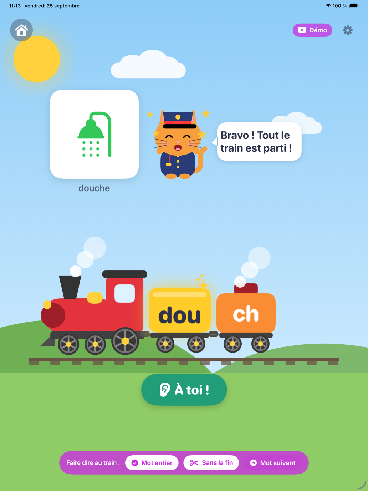

# `eveil/` — Suite Éveil : le Petit Train des mots (iPad, 3 ans et +)

Le code de l'app 1 de la [Suite Éveil](../docs/EVEIL.md) : un petit train dont les **wagons
s'allument syllabe par syllabe** pendant que l'enfant parle, et dont le **fourgon de queue
s'accroche** quand il produit la **consonne finale** du mot (« dou**che** », « minou**che** »).
Tout est calculé **sur l'appareil**, sans modèle opaque, avec une règle d'or : ne jamais dire
« il manque la fin » sans preuve d'absence.

| Dossier | Contenu | Statut |
|---|---|---|
| [`reference/wordend/`](reference/wordend/) | Détecteur de référence **Python stdlib** : DSP, détecteur, flux temps réel, pédagogie, lexiques, **banc de validation**, vecteurs de parité, démo | ✅ 69 tests verts |
| [`ios/`](ios/) | **Swift** : paquet autonome [`WordEndCore`](ios/WordEndCore/) (portage ligne à ligne, Swift pur, testable seul) + paquet app `WordEndAudio` (AVFoundation) / `TrainPracticeUI` (SwiftUI/SwiftData) / `EveilDesign` (décor, mascotte) / `ColoringUI` (atelier) + **projet Xcode** [`App/EveilTrain.xcodeproj`](ios/App/) | ✅ **app jouable dans le simulateur** ([captures](#lapp-ipad--ébauche-jouable-25092026)) · cœur 19/19 · démo 52 cas |
| [`lexique/`](lexique/) | Mots cibles **FR** et **EN** conçus séparément (propositions à valider par un panel) | 🟡 à valider |
| [`outils/`](outils/) | Garde-fou « rien ne quitte l'iPad » (analyse statique du code Swift) | ✅ 7 tests, 0 violation |
| [`librarybrain/`](librarybrain/) | Relais vers LibraryBrain : sources en accès libre, veille arXiv, questions à poser, [protocole de comparaison](librarybrain/COMPARAISON.md) avec la passe cloud, [`interroger.py`](librarybrain/interroger.py) (les 33 questions, scriptées), [`mesurer.py`](librarybrain/mesurer.py) — comparaison faite : [rapport](../docs/EVEIL-SOURCES-LIBRARYBRAIN.md) | ✅ 20 tests |

---

## Essayer tout de suite (aucune dépendance, aucun micro)

```bash
cd eveil/reference
python3 -m wordend.demo                              # le train en ASCII, sur des signaux synthétiques
python3 -m unittest discover -s wordend -t . -v      # 69 tests
python3 -m wordend.bench --demo                      # le banc de validation (corpus synthétique)
python3 ../outils/verifier_confidentialite.py        # « rien ne quitte l'iPad »
```

Extrait de la démo :

```text
cible      prononcé               verdict              ce que voit l'enfant
douche     douche                 COMPLET              🚂[DOU]═[CH]
douche     dou                    FIN MANQUANTE        🚂[DOU]   [ch] resté en gare  ← la mascotte le montre
minouche   minou                  FIN MANQUANTE        🚂[MI]═[NOU]   [ch] resté en gare  ← la mascotte le montre
minouche   mi                     SYLLABE(S) EN MOINS  🚂[··]═[···]   (ch) en attente
douche     dou snr_db=12          INCERTAIN            🚂[···]   (ch) en attente  (low_snr)
douche     douche f0_start=120    INCERTAIN            🚂[···]   (ch) en attente  (adult_voice_suspected)

Flux temps réel — « minouche », blocs de 10 ms :
  t =  0.28 s   parole détectée
  t =  0.39 s   wagon 1 allumé (mi)
  t =  0.72 s   wagon 2 allumé (nou)
  t =  0.77 s   fourgon accroché (ch)
  t =  1.75 s   fin d'énoncé (silence) → COMPLET
```

> ⚠️ Les signaux de la démo et des tests sont **synthétiques** (source glottique + formants,
> bruit filtré) : ils prouvent la **logique** du détecteur, pas sa validité sur de vraies voix
> d'enfants. Celle-ci se mesure avec le banc, dans le protocole de validation
> ([docs/EVEIL.md §8](../docs/EVEIL.md#8-validation-par-les-pairs--le-protocole)).

## L'app iPad — ébauche jouable (25/09/2026)

| Accueil | Le fourgon s'accroche | Le fourgon reste en gare | Atelier de coloriage |
|---|---|---|---|
|  |  |  |  |

- **Accueil** : le chat chef de gare (mascotte **provisoire**) propose deux jeux, en grandes cartes.
- **Le petit train des mots** : plein écran ; le train entre en gare à chaque mot ; un wagon par
  syllabe orale s'allume pendant que l'enfant parle ; le fourgon de la consonne finale s'accroche
  (vapeur « chhh ») ou reste en gare, sur son quai ; le chat écoute, fait la fête ou montre
  gentiment le fourgon ; un seul gros bouton « À toi ! ». Aucun message négatif.
- **Mode démo** (espace des grands › Présentation, ou argument de lancement `-eveil.demoMode 1`) :
  micro fermé ; le présentateur fait « entendre » au train un mot entier, un mot sans la fin ou une
  syllabe en moins — une pseudo-parole de `Synth` qui passe par le **vrai** détecteur — puis
  « Mot suivant ». Rien n'est écrit dans le journal local. `swift test` (dans `ios/`) vérifie que
  chaque bouton produit le verdict annoncé, pour tous les mots FR et EN (52 cas).
- **Atelier de coloriage** (app 2, « mode écran ») : trois pages (le petit train, le chat, la
  maison) ; toucher une forme la remplit, le pinceau ne déborde jamais (pochoir) ; dix grosses
  couleurs ; annuler, tout effacer, page suivante. Rien n'est enregistré ni envoyé.

```bash
open eveil/ios/App/EveilTrain.xcodeproj          # schéma EveilTrain, un iPad du simulateur, ▶︎
cd eveil/ios && swift test                        # le mode démo montre ce qu'il annonce
```

Provisoire, à trancher : nom affiché « Petit Train » et identifiant `fr.klodynlov.eveil.petittrain`,
cible iPadOS 17 (celle du paquet), toutes orientations, mascotte, dessins vectoriels (en attendant
un illustrateur), voix du mot = synthèse système (en attendant les enregistrements). Reste : l'iPad
réel (signature, micro, Accès guidé), les illustrations, les voix, les sons, le panel.

## Sur Mac — compilé et testé le 25/09/2026

macOS 27.0 (26A428) · Xcode 27.0 (27A266a) · Swift 6.4 (swiftlang-6.4.0.34.1) · SDK iOS 27.0.
Prérequis : `xcode-select -p` → `/Applications/Xcode.app/…` (avec les seuls CommandLineTools, XCTest manque).

```bash
cd eveil/ios/WordEndCore && swift test        # 19 tests, 0 échec, 0 avertissement
cd eveil/ios && xcodebuild -scheme EveilTrain-Package \
    -destination 'generic/platform=iOS Simulator' build   # ** BUILD SUCCEEDED **, 0 avertissement
```

- **Cœur** : 19/19 dès la première compilation, dont les 5 tests de parité (17 cas golden, les
  5 verdicts représentés). La parité **mord** — vérifié par mutation d'une copie : plancher de bruit
  au 12ᵉ centile au lieu du 10ᵉ → 83 assertions rouges ; seuil de friction à 100 ms au lieu de 50 →
  rouge. Limite : aucune friction des 17 cas ne dure moins de 80 ms, la bande 50–80 ms du seuil n'est
  donc pas sondée par les vecteurs golden (un seuil à 80 ms passerait).
- **Couche app** : `EveilTrain-Package` compile pour le simulateur iOS, l'appareil iOS (sans
  signature) et macOS, aussi en mode de langage Swift 6. Les 4 avertissements de concurrence du
  premier build (`ListeningController`) sont corrigés : le traqueur, confiné à la file d'analyse,
  passe par une boîte locale qui porte ce contrat (plutôt que de déclarer `StreamingTracker`
  Sendable dans le cœur, ce qu'il n'est pas), et le `[weak self]` de `stop()` est remonté au bloc
  englobant, qui capturait `self` fortement.
- **Coquille** [`App/EveilTrainApp.swift`](ios/App/EveilTrainApp.swift) : type-checkée seule contre
  les modules compilés (simulateur iOS 17, Swift 5 et 6). Le projet Xcode reste à créer.
- **SDK iOS 27** : `installTap(onBus:…)` y est bien déprécié, remplacé en Swift par
  `installAudioTap(onBus:bufferSize:format:tapProvider:)` — la note de `MicrophoneStream.swift` est
  exacte ; la bascule dépend de la cible retenue (iPadOS 17 ou 26).
- **Garde de confidentialité** : elle ignore désormais les produits de compilation (`.build/`,
  `.swiftpm/`, `DerivedData/`) ; après `swift test`, elle comptait un fichier Swift généré de plus.

> **Reprendre en local** (compilation Swift + comparaison LibraryBrain) : prompt prêt à coller dans
> [`REPRISE-LOCALE.md`](REPRISE-LOCALE.md).

App iPad : le projet [`ios/App/EveilTrain.xcodeproj`](ios/App/) est prêt — paquets locaux `eveil/ios` et
`eveil/ios/WordEndCore`, coquille et accueil ([`App/`](ios/App/)), lexiques FR/EN, `PrivacyInfo.xcprivacy`,
clés micro dans les réglages de la cible. Sur un iPad réel, il ne manque que l'équipe de signature (à
choisir dans Xcode). Aucun entitlement iCloud, aucun SDK tiers.

---

## Comment ça marche (résumé)

1. **Capture** : micro intégré, `AVAudioSession` en mode `.measurement` (pas d'AGC ni de réduction
   de bruit : les sibilantes sont du bruit haute fréquence), conversion en 24 kHz mono, **en mémoire**.
2. **Trames** de 21,3 ms toutes les 10 ms : énergie, bande « voyelle » (0,3-2,5 kHz), bande
   « friction » (3-11 kHz), centroïde, passages par zéro.
3. **Noyaux syllabiques** : pics voisés de l'enveloppe basse fréquence séparés par un creux
   (à la de Jong & Wempe). Un noyau = un wagon.
4. **Consonne finale** : friction haute fréquence ≥ 50 ms qui suit la dernière voyelle de près.
   Schwa final toléré (« dou-che-e »). Le lieu (/ʃ/ vs /s/) est noté, jamais sanctionné.
5. **Verdict asymétrique** : *complet*, *consonne finale absente* (seulement sur preuve d'absence),
   *syllabe(s) en moins*, *incertain* (avec une raison lisible), *rien entendu*.
6. **Pédagogie** (`policy.py` / `Policy.swift`) : on ne montre du doigt le fourgon que sur un verdict
   sûr, jamais de message négatif, pas de boucle d'échec, séances courtes.

## Le banc de validation (pour les orthophonistes)

```bash
python3 -m wordend.bench --wav-dir enregistrements/ --annotations annotations.csv \
    --lexique ../lexique/fr-FR.json --rapport rapport.md --sorties verdicts.csv
```

Deux orthophonistes jugent chaque enregistrement **indépendamment**
(`complet` / `fin_absente` / `syllabe_absente` / `autre`). Le banc calcule leur accord (κ de Cohen),
compare le détecteur à leur **consensus**, et rend une porte **GO / NO GO** : κ ≥ 0,6, borne haute de
l'IC95 (Wilson) de la **fausse alerte** ≤ 10 %, incertitude ≤ 30 %. Le banc est un **outil de
recherche**, distinct de l'app publique (qui ne produit ni score ni rapport).

## Parité Python ↔ Swift

La parité est tenue **par construction** — même PRNG (SplitMix64), même synthèse, mêmes constantes —
et **vérifiée à la compilation** depuis le 25/09/2026. `python3 -m wordend.golden` fige 17 cas
(sommes de contrôle du signal, descripteurs, analyse, verdict) dans
`ios/WordEndCore/Tests/WordEndCoreTests/Resources/golden_vectors.json` ; `GoldenVectorsTests.swift` les
retrouve (`swift test`). Un test Python échoue si le fichier est périmé.
