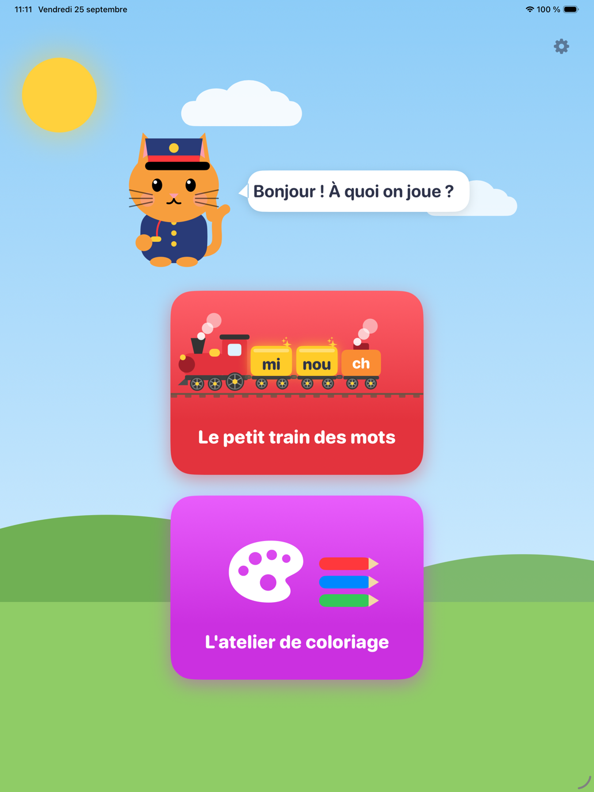
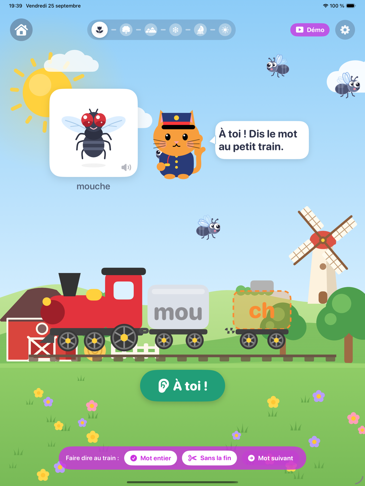
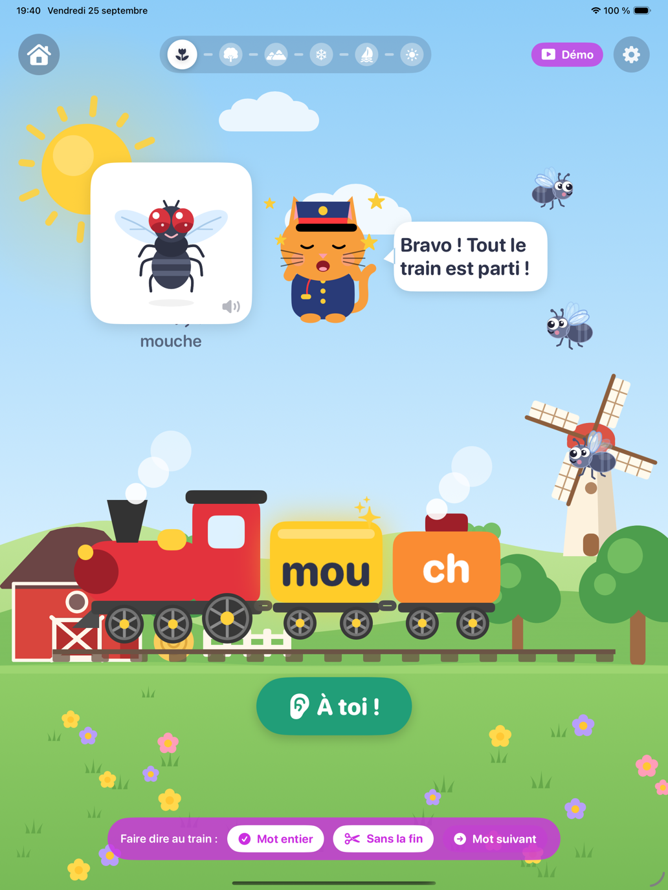
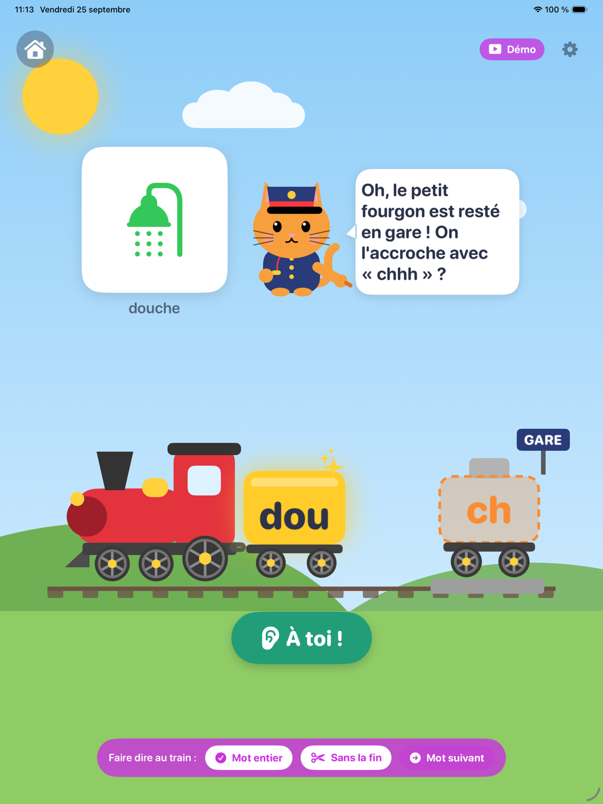
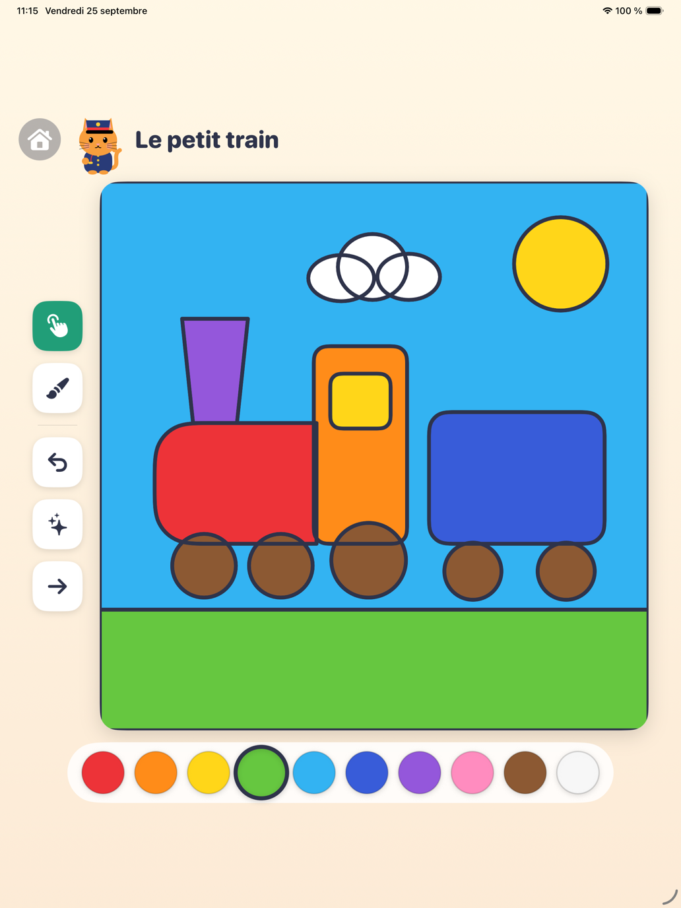
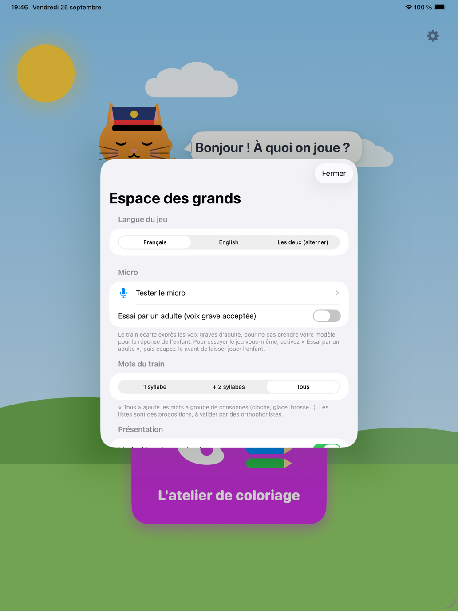
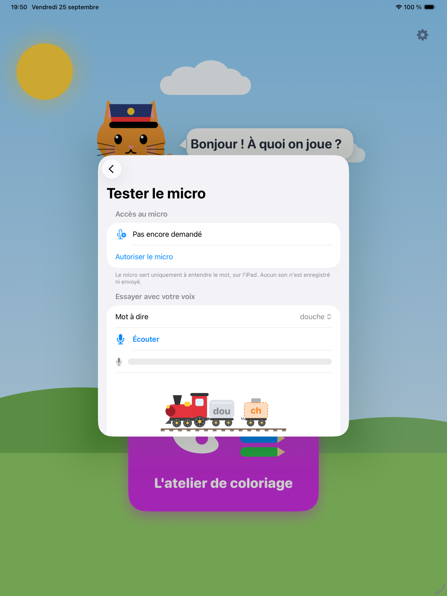

# `eveil/` — Suite Éveil : le Petit Train des mots (iPad, 3 ans et +)

Le code de l'app 1 de la [Suite Éveil](../docs/EVEIL.md) : un petit train dont les **wagons
s'allument syllabe par syllabe** pendant que l'enfant parle, et dont le **fourgon de queue
s'accroche** quand il produit la **consonne finale** du mot (« dou**che** », « minou**che** »).
Tout est calculé **sur l'appareil**, sans modèle opaque, avec une règle d'or : ne jamais dire
« il manque la fin » sans preuve d'absence.

| Dossier | Contenu | Statut |
|---|---|---|
| [`reference/wordend/`](reference/wordend/) | Détecteur de référence **Python stdlib** : DSP, détecteur, flux temps réel, pédagogie, lexiques, **banc de validation**, vecteurs de parité, démo | ✅ 69 tests verts |
| [`ios/`](ios/) | **Swift** : paquet autonome [`WordEndCore`](ios/WordEndCore/) (portage ligne à ligne, Swift pur, testable seul) + paquet app `WordEndAudio` (AVFoundation) / `TrainPracticeUI` (SwiftUI/SwiftData) / `EveilDesign` (mondes, dessins des mots, bestioles, mascotte) / `EveilSounds` (bruitages calculés) / `ColoringUI` (atelier) + **projet Xcode** [`App/EveilTrain.xcodeproj`](ios/App/) | ✅ **app jouable, installée sur un iPad réel** ([captures](#lapp-ipad--ébauche-jouable-essayée-sur-un-vrai-ipad-25092026)) · cœur 19/19 · app 103 tests |
| [`lexique/`](lexique/) | Mots cibles **FR** et **EN** conçus séparément (propositions à valider par un panel) | 🟡 à valider |
| [`outils/`](outils/) | Garde-fou « rien ne quitte l'iPad » (analyse statique du code Swift) + [`coloriages/`](outils/coloriages/) : les pages de l'atelier **dessinées en Python** (traits visibles, carte des zones simulée, témoins) → [`PagesDessins.swift`](ios/Sources/ColoringUI/PagesDessins.swift) + [`papier/`](outils/papier/) : le mode papier sur photos simulées | ✅ 25 tests, 0 violation, 55 pages générées · papier 11 tests |
| [`librarybrain/`](librarybrain/) | Relais vers LibraryBrain : sources en accès libre, veille arXiv, questions à poser, [protocole de comparaison](librarybrain/COMPARAISON.md) avec la passe cloud, [`interroger.py`](librarybrain/interroger.py) (les 33 questions, scriptées), [`mesurer.py`](librarybrain/mesurer.py) — comparaison faite : [rapport](../docs/EVEIL-SOURCES-LIBRARYBRAIN.md) | ✅ 20 tests |

---

## Essayer tout de suite (aucune dépendance, aucun micro)

```bash
cd eveil/reference
python3 -m wordend.demo                              # le train en ASCII, sur des signaux synthétiques
python3 -m unittest discover -s wordend -t . -v      # 69 tests
python3 -m wordend.bench --demo                      # le banc de validation (corpus synthétique)
python3 ../outils/verifier_confidentialite.py        # « rien ne quitte l'iPad »
```

Extrait de la démo :

```text
cible      prononcé               verdict              ce que voit l'enfant
douche     douche                 COMPLET              🚂[DOU]═[CH]
douche     dou                    FIN MANQUANTE        🚂[DOU]   [ch] resté en gare  ← la mascotte le montre
minouche   minou                  FIN MANQUANTE        🚂[MI]═[NOU]   [ch] resté en gare  ← la mascotte le montre
minouche   mi                     SYLLABE(S) EN MOINS  🚂[··]═[···]   (ch) en attente
douche     dou snr_db=12          INCERTAIN            🚂[···]   (ch) en attente  (low_snr)
douche     douche f0_start=120    INCERTAIN            🚂[···]   (ch) en attente  (adult_voice_suspected)

Flux temps réel — « minouche », blocs de 10 ms :
  t =  0.28 s   parole détectée
  t =  0.39 s   wagon 1 allumé (mi)
  t =  0.72 s   wagon 2 allumé (nou)
  t =  0.77 s   fourgon accroché (ch)
  t =  1.75 s   fin d'énoncé (silence) → COMPLET
```

> ⚠️ Les signaux de la démo et des tests sont **synthétiques** (source glottique + formants,
> bruit filtré) : ils prouvent la **logique** du détecteur, pas sa validité sur de vraies voix
> d'enfants. Celle-ci se mesure avec le banc, dans le protocole de validation
> ([docs/EVEIL.md §8](../docs/EVEIL.md#8-validation-par-les-pairs--le-protocole)).

## L'app iPad — ébauche jouable, essayée sur un vrai iPad (25/09/2026)

| Accueil | « mouche » : les mouches volent | Mot entier : le fourgon s'accroche | Sans la fin : resté en gare |
|---|---|---|---|
|  |  |  |  |

| Atelier de coloriage | Espace des grands | Tester le micro |
|---|---|---|
|  |  |  |

Premier tour dans le simulateur le matin, puis **sur l'iPad de l'utilisateur** (iPad Pro 11" M1,
iPadOS 27) l'après-midi. Ses retours ont fait le second tour :

- **Le petit train des mots** : plein écran ; un wagon par syllabe orale s'allume pendant que
  l'enfant parle ; le fourgon de la consonne finale s'accroche (« chhh » la vapeur, « sss » le
  serpent) ou reste en gare, sur son quai, et le chat le montre gentiment. Aucun message négatif.
  - **Un mot bien dit, on enchaîne** : le train siffle, quitte la gare et entre dans **un autre
    monde** avec le mot suivant — campagne, forêt, montagne, banquise, mer, désert, ville, espace,
    dans cet ordre (un voyage, jamais un tirage au sort). La ligne du voyage, en haut, montre les
    six gares de la séance. Après trois essais, on félicite l'effort et le train repart aussi.
  - **Des images qui vivent** : chaque mot a son dessin ; le toucher lui fait faire son bruit et
    une petite action (la cloche se balance, la vache meugle). Derrière le mot volent de petites
    bêtes : pour « mouche », des mouches — on en attrape une, elle fait « bzzz ».
  - **Tour de parole strict** : tout se tait pendant que le train dit le mot et pendant l'écoute ;
    les bestioles ralentissent et, touchées, frétillent sans bruit.
  - **Plus de mots** : 28 en français, 17 en anglais (propositions à valider, cf.
    [`lexique/`](lexique/)) ; chaque séance reprend où l'autre s'est arrêtée.
  - **Une syllabe d'abord** (06/10/2026, conseil d'une orthophoniste) : l'enfant commence par les
    mots d'une syllabe, **de tous les sons** (jus, peau, dé, fée, lait… d'abord : syllabes ouvertes ; puis mur, sac, lune, vert… ; les mots
    dessinés des livres entrent dans le train sans fourgon, jugés sur leurs syllabes :
    `python3 -m livres.train` les écrit dans les lexiques ; seuls « ch » et « s » ont un fourgon) ; quand il en a dit 6 différents en entier (ou tous s'il y en a moins), les
    mots de deux syllabes arrivent à la séance suivante, puis les groupes de consonnes, puis tous
    les mots mêlés. Jamais de retour en arrière tout seul ; l'adulte règle le niveau dans l'espace
    des grands ; rien n'est compté en démo ni en essai par un adulte ; aucun nombre affiché
    (`reference/wordend/policy.py`, règle 8 → `WordDeck`, `LevelProgress`, `TrainLevelStore`).
- **Un micro « plus réceptif »** : le détecteur écarte EXPRÈS les voix graves d'adulte (hauteur
  médiane < 165 Hz ⇒ « incertain »), pour ne pas prendre le modèle d'un parent pour la réponse de
  l'enfant — un adulte qui essaie n'est donc jamais entendu. L'espace des grands propose
  **« Essai par un adulte »** (ne lève que cette garde ; à couper avant de laisser jouer l'enfant)
  et **« Tester le micro »** (accès au micro, vumètre, petit train, explication en clair de ce qui
  a été entendu). L'enfant a dix secondes pour commencer à parler (six dans la référence) ; des
  barres dansent avec sa voix pendant l'écoute. Les valeurs du détecteur, partagées avec la
  référence Python et les vecteurs de parité, ne changent pas.
- **Bruitages** ([`EveilSounds`](ios/Sources/EveilSounds/)) : 53 sons **calculés sur l'appareil**
  (aucun fichier son, rien d'enregistré), même niveau perçu, jamais pendant l'écoute. Provisoires :
  jugés à la mesure, à l'oreille sur l'iPad ensuite.
- **Atelier de coloriage** (app 2, « mode écran ») : **70 pages au trait**, rangées en **7 albums**
  (le petit train, les animaux, le jardin, à la maison, miam !, en route !, la fête). **Chaque zone
  fermée par des traits se colorie à part**, comme sur papier (carte des zones 1024², calculée à
  l'ouverture) ; les couleurs passent sous les traits, qui restent nets. Le pinceau reste dans la
  zone où il a commencé (pochoir) ; toucher pour remplir une zone d'un coup est possible, mais
  **désactivé par défaut** (espace des grands › « Remplir d'un toucher ») ; annuler, tout effacer, choisir un dessin :
  les albums en haut (un grand bouton-image chacun), **toutes** les pages de l'album d'un coup, sans
  défiler (12 au plus par album). Rien n'est enregistré ni envoyé.
  - **Un dessin pour chacun des 45 mots du petit train** (le même sujet que son image dans le jeu :
    la pêche est le fruit, la brosse à dents a son dentifrice, « wash » se lave les mains…), plus
    les éléments du train et d'autres pages. 15 pages sont écrites à la main en Swift ; **55 sont
    dessinées avec [`outils/coloriages/`](outils/coloriages/)** : formes empilées du fond vers
    l'avant, traits visibles calculés avec le même algorithme que l'app, carte des zones simulée
    avec ses règles (rastérisation, étiquetage, miettes). Chaque zone reçoit un point-témoin ;
    chaque petite zone doit être un détail voulu (œil, bouton), sinon c'est une miette de dessin, à
    corriger ; et tout doit tenir si le trait est 1 px plus fin, plus épais ou décalé.
    [Planche des 55 pages](../docs/ui/eveil-app/7-coloriages.png).
- **Mode démo** (espace des grands › Présentation, ou argument de lancement `-eveil.demoMode 1`) :
  micro fermé ; le présentateur fait « entendre » au train un mot entier, un mot sans la fin ou une
  syllabe en moins — une pseudo-parole de `Synth` qui passe par le **vrai** détecteur — puis
  « Mot suivant ». Rien n'est écrit dans le journal local.
- Tous les mouvements (train, vapeur, chat, bestioles, mondes) sont calculés à partir de l'heure :
  les boucles d'animation SwiftUI faisaient clignoter ou trembler le train. « Réduire les
  animations » fige tout.

**Troisième tour (28/09/2026, session cloud — compilé, testé et installé sur l'iPad le soir même, voir [plus bas](#sur-mac--troisième-tour-compilé-le-28092026))**, sur ses retours
« voix trop générique : voix féminine naturelle, qui suit les syllabes » et « afficher un décompte
pour le nombre de fois que l'enfant doit répéter » :

- **La voix** ([`VoiceCatalog`](ios/Sources/WordEndAudio/VoiceCatalog.swift)) : le jeu prend la
  meilleure voix **féminine** installée dans l'accent du jeu (fr-FR avant fr-CA), jamais une voix
  fantaisie ni « Eloquence », premium puis améliorée puis standard. L'espace des grands montre la
  voix choisie, en propose d'autres (« Écouter la voix »), et explique comment télécharger une voix
  premium ou améliorée dans les Réglages de l'iPad (l'app ne télécharge rien). La **Voix
  personnelle** d'un parent (iOS 17) peut aussi servir, sur autorisation ; elle reste sur l'iPad.
- **Une voix qui suit les syllabes** : le mot modèle se dit d'abord **syllabe par syllabe**, chaque
  wagon s'allumant avec SA syllabe et le fourgon s'accrochant sur la consonne finale (« mi · nouch »),
  puis le mot entier ; le chat parle pendant ce temps. La prononciation est **imposée par l'API du
  lexique** (`AVSpeechSynthesisIPANotationAttribute`) : la consonne finale est bien dite. Réglable
  (« Le mot modèle syllabe par syllabe », activé par défaut). Référence Python :
  `lexicon.voice_segments` ; les deux lexiques sont vérifiés (syllabes de l'API = wagons, et la
  dernière syllabe finit par la consonne du fourgon).
- **Le décompte** ([`RepetitionMeter`](ios/Sources/TrainPracticeUI/RepetitionMeter.swift)) : l'adulte
  règle le nombre de répétitions par mot (1 à 5, **3 par défaut**) ; un gros chiffre (ce qui reste)
  et une lanterne par répétition. Chaque mot bien dit allume une lanterne ; « Bravo ! Encore 2 fois ! »,
  la voix dit « Encore ! » et le micro se rouvre ; le train part quand le décompte est fini. Seul un
  mot bien dit fait avancer le décompte, et chaque répétition garde la règle « pas de boucle
  d'échec » : après trois essais, on félicite l'effort et le train repart quand même. Référence
  Python : `policy.RepetitionPlan`, `feedback_for(…, repetitions_left=…)`, portés dans
  `WordEndCore` avec leurs tests miroirs.
- **Les étoiles** (« plus c'est bien répété, plus de points ») : chaque essai rapporte des étoiles
  de jeu qui s'envolent du train vers le compteur — mot entier 3, toutes les syllabes sans la fin 2,
  doute du détecteur 2, syllabe en moins 1, rien entendu 0 ; on n'en perd jamais. Le trésor (un
  total) s'affiche sur l'accueil et en fin de voyage ; l'adulte peut masquer les étoiles ou vider le
  trésor. Ce n'est **pas** un score de langage (pas de pourcentage, de courbe, de détail par son, ni
  d'export — [docs/EVEIL.md § 7.3](../docs/EVEIL.md#73-la-frontière-du-dispositif-médical)).
  Référence : `policy.stars_for`.
- **Toucher les syllabes** (« entendre les syllabes quand on les touche ») : toucher un wagon fait
  dire SA syllabe (la dernière sans la consonne finale, qui est dans le fourgon : « mi », « nou ») ;
  toucher le fourgon fait sa vapeur (« chhh ») ou son serpent (« sss ») et la voix dit la consonne.
  Jamais pendant l'écoute ni pendant le modèle. Référence : `lexicon.wagon_segments`,
  `caboose_segment` (wagons + fourgon = le mot, vérifié sur les 45 mots).
- **Un son pour chaque syllabe bien dite** : le micro ne doit jamais entendre le jeu (il prendrait
  un « ding » pour une syllabe) ; donc, dès la fin de l'écoute, le train rejoue ses wagons — un ding
  par wagon allumé, en arpège (do, mi, sol, do), puis le « chhh » du fourgon accroché.
- **Le train des phrases** (« au niveau d'OrthoPicto, voire plus », cf.
  [docs/EVEIL.md § 4.8](../docs/EVEIL.md#48-le-train-des-phrases-demande-du-28092026--au-niveau-dorthopicto-voire-plus)) :
  l'enfant construit une phrase avec des pictos — la locomotive porte « qui ? », un wagon par morceau
  (« fait quoi ? », « quoi ? », « où ? »), couleurs par rôle — et la **scène la joue**, quelle qu'elle
  soit : 20 verbes animés, 30 sujets, 57 compléments, 8 lieux (31 mises en scène avec « dans, sur, sous, devant, derrière ») (« la vache mange la
  bûche », « Lou se cache sous la table »). Trois niveaux (2 wagons, 3 wagons, « où ? ») ; la voix pose
  la question avec ce qui est choisi (« Que fait le chat ? ») et nomme chaque picto ; la phrase se dit
  morceau par morceau puis d'une traite ; toucher un wagon le redit et permet de le changer. Éveil à la
  lecture : mots écrits, phrase colorée par rôle, capitales au choix. Aucun micro : l'adulte touche
  « Il l'a dite ! » → étoiles. Lexique, grammaire FR/EN (élision « l'autruche ») et niveaux en Python
  ([`outils/phrases`](outils/phrases/)), portés dans `PhraseCore` (vecteurs de parité) ; pictos des
  verbes et des lieux dessinés en Python ([`outils/pictos`](outils/pictos/)) ; mouvements testés.
- **Les jeux d'écoute** (« voire plus ») : le **loto des bruits** (un bruit — « meuh » — et trois
  images : laquelle fait ce bruit ? chaque image touchée sonne) et **« Où est… ? »** (2 à 4 images,
  vocabulaire en compréhension). Jamais « faux » : une autre image est nommée (« Ça, c'est le chat. »)
  et on réécoute ; manches dans un ordre fixe.
- **Les livres des sons** (cf. [docs/EVEIL.md § 4.9](../docs/EVEIL.md#49-les-livres-des-sons-et-les-jeux-découte-28092026)) :
  un livre par son — 16 en français, 15 en anglais — **calculé** à partir des mots dessinés qui
  contiennent le son, au début, au milieu, à la fin ([`outils/livres`](outils/livres/)) ; 57 mots
  dessinés pour eux ([`outils/pictos`](outils/pictos/), familles `mot.`). Le livre se parcourt dans le
  petit train : wagon du son marqué d'une étoile, **lettres colorées**, voix syllabe par syllabe ;
  le micro **écoute comme au petit train** (wagons allumés à la voix, verdict sur les syllabes) et
  l'adulte garde « Il l'a dit ! » pour le son du livre (le détecteur ne juge que la fin des mots) ;
  « Pour les grands » : l'image sonore du son et une idée de jeu sans écran (propositions à valider).
- **Les phrases des livres** (la page d'OrthoPicto) : sur l'étagère, trois niveaux — les mots, **les
  phrases** (« La vache pousse la bûche. »), **« et où ? »** (« Le chat chante dans la niche. »),
  6 phrases par niveau et par livre, choisies pour porter le son
  ([`outils/livres/phrases.py`](outils/livres/phrases.py)). L'image de la phrase finie, la voix la lit ;
  « À toi ! » : l'enfant la **reconstruit** wagon par wagon parmi trois pictos (les cartes « où ? »
  montrent le sujet dans, sur, sous… le lieu) ; un autre picto est nommé, le bon s'éclaire ; puis la
  scène **joue** la phrase. Lettres du son colorées à la bonne place (syllabe, puis place du son) ;
  l'adulte juge → étoiles.
- **L'atelier de coloriage** (« plus de couleurs, la gomme, un mode interactif au choix ») :
  **24 couleurs** (dont quatre couleurs de peau), toutes visibles d'un coup — 3 rangées de 8 en
  portrait, 6 rangées de 4 en paysage ; la **gomme** rend le papier blanc sans déborder de sa zone
  (annulable) ; « choisir un dessin » et « page suivante » passent dans l'en-tête. Le **mode
  interactif** (bouton baguette magique, éteint par défaut) : la voix nomme la couleur choisie,
  chaque couleur chante sa note quand on peint (gamme pentatonique : jamais de fausse note), et
  « J'ai fini ! » fait prendre vie au dessin (il danse, confettis, fanfare, « Bravo ! »).
- **Les consignes de coloriage** (la suite choisie le 28/09/2026), en mode interactif : la voix
  donne une consigne — « Colorie le soleil en jaune ! » — affichée à la place du titre (la toucher
  la redit). Chaque page a ses **parties nommées**, le sujet d'abord puis le décor ; une couleur
  imposée quand elle va de soi (le soleil jaune, l'herbe verte, les roues noires), sinon une couleur
  franche dans un ordre fixe. La consigne est réussie quand la partie a reçu assez de cette couleur
  (un remplissage, ou quelques coups de pinceau) : étincelles, « Bravo ! », la suivante ; cinq au
  plus par page. Jamais « faux » : colorier ailleurs ne coûte rien (au deuxième essai, la consigne
  se redit et un anneau montre où) ; une autre couleur sur la bonne partie : « En jaune ! », et la
  bonne pastille s'éclaire. Quelques parties sont **au choix** : « Colorie les mains, de la couleur
  que tu veux ! » — pour la peau, on n'impose jamais une couleur (aussi la tache de peinture, la
  voiture de police). 305 parties nommées sur les 70 pages, 279 consignes (2 à 5 par page). Les
  parties des 55 pages dessinées en Python sont nommées et contrôlées par l'outil (des zones
  entières, assez grandes, jamais deux noms sur une zone ; l'ordre des consignes se règle par page :
  la coccinelle avant sa feuille) ; celles des 15 pages Swift reposent sur leurs points-témoins ; un
  test Swift vérifie que chaque consigne de chaque page se réussit.
- **Le dessin prend vie** (la suite choisie ensuite) : au « J'ai fini ! » du mode interactif, les
  parties bougent quelques secondes **avec les couleurs de l'enfant** — les roues tournent, le soleil
  bat, la queue remue, les ailes battent, le feuillage se balance sur son tronc, les nuages glissent,
  les ballons flottent, le tee-shirt tourne dans la machine. Chaque partie est découpée dans le
  coloriage, son emplacement rebouché avec les couleurs voisines ; elle bouge autour de son attache
  (le milieu de son contact avec le reste du dessin). Toucher la page arrête la fête. 69 pages sur 70
  bougent (le cirque danse seulement en entier). Référence et planches en Python
  ([`outils/coloriages/vivant.py`](outils/coloriages/vivant.py) :
  `python3 -m coloriages.vivant --planche DOSSIER`), portage dans `ColoringUI/LivingDrawing.swift`.
  [Planche](../docs/ui/eveil-app/9-dessin-vivant.png).
- **Le mode papier** (la suite choisie ensuite) : bouton « Colorier sur papier », en bas de la colonne
  d'outils de l'atelier. On **imprime** la page (un PDF A4 fait sur l'iPad : le dessin et quatre
  carrés noirs autour), l'enfant la **colorie aux vrais crayons**, on la **photographie** avec le
  scanner de documents d'iPadOS. L'atelier retrouve les quatre carrés (même feuille de côté ou à
  l'envers), redresse la photo, reconnaît la page (ou ouvre celle qu'on a photographiée, parmi les
  70), pose les coups de crayon sous ses traits — le grain du crayon se voit — et **le dessin prend
  vie**. Une photo illisible : « Je n'ai pas bien vu la page. On réessaie ? ». La photo reste en
  mémoire le temps de la lire, jamais enregistrée ni envoyée.
  Référence sur photos simulées ([`outils/papier/`](outils/papier/) : perspective, lumière chaude,
  grain ; `python3 -m papier.planche DOSSIER`), portage dans `ColoringUI/PaperMode.swift` et
  `PaperSheet.swift`. [Planche](../docs/ui/eveil-app/10-mode-papier.png).

```bash
open eveil/ios/App/EveilTrain.xcodeproj           # schéma EveilTrain, un iPad du simulateur, ▶︎
cd eveil/ios && swift test                         # 103 tests : démo, écoute, sons, dessins, coloriage
cd eveil/outils && python3 -m coloriages.generer --check        # les 55 pages générées sont à jour
python3 -m coloriages.generer --apercu /tmp/coloriages          # planche + traits/zones de chaque page
```

Sur un **iPad réel** (mode développeur activé sur la tablette, équipe de signature Apple
Developer ; l'équipe ne va pas dans le dépôt public) :

```bash
cd eveil/ios && xcodebuild -project App/EveilTrain.xcodeproj -scheme EveilTrain \
    -destination 'platform=iOS,id=<UDID>' -allowProvisioningUpdates \
    -allowProvisioningDeviceRegistration DEVELOPMENT_TEAM=<ÉQUIPE> build
xcrun devicectl device install app --device <UDID> <DerivedData>/Build/Products/Debug-iphoneos/EveilTrain.app
xcrun devicectl device process launch --device <UDID> fr.klodynlov.eveil.petittrain
```

Icône de l'app (`App/Assets.xcassets/AppIcon.appiconset/AppIcon.png`, 1024 × 1024 sans alpha) :
dessinée en SwiftUI (`TrainPracticeUI/AppIconArt.swift` : le chat chef de gare salue la locomotive
de l'accueil), régénérée par un test, puis copiée à la main :

```bash
cd eveil/ios && EVEIL_APPICON_OUT=/tmp/icone swift test --filter AppIconTests   # AppIcon.png + variantes
cp /tmp/icone/AppIcon.png App/Assets.xcassets/AppIcon.appiconset/AppIcon.png
```

Provisoire, à trancher : nom affiché « Petit Train » et identifiant `fr.klodynlov.eveil.petittrain`,
icône (variante `catAndLoco` ; autres : `cat`, `catOverTrain`),
cible iPadOS 17 (celle du paquet), toutes orientations, mascotte (chat chef de gare), dessins
vectoriels (en attendant un illustrateur), bruitages synthétisés (en attendant de vrais sons), voix
du mot = synthèse système (en attendant les enregistrements). Reste : l'Accès guidé à vérifier sur
l'iPad, les voix, le panel.

## Sur Mac — troisième tour compilé le 28/09/2026

Même Mac (macOS 27.0 26A428 · Xcode 27.0 27A266a · Swift 6.4 · SDK iOS 27.0), tête `51f6238` + correctif.

```bash
python3 -m unittest discover -s eveil/outils                               # 127 tests
(cd eveil/reference && python3 -m unittest discover -s wordend -t .)       # 83 tests
(cd eveil/ios/WordEndCore && swift test)                                   # 30 tests
(cd eveil/ios && swift test)                                               # 186 tests
(cd eveil/ios && xcodebuild -scheme EveilTrain-Package \
    -destination 'generic/platform=iOS Simulator' build)                   # BUILD SUCCEEDED
```

- **Tout vert, 0 avertissement** (build propre `swift package clean`, puis simulateur iOS et iPad réel) :
  Python 127 + 83, Swift 30 + 184 (PhraseCore 13, EveilTrain 25, EveilSounds 40, EveilDesign 31,
  ColoringUI 75 — dont `ColoringInstructionsTests` 8, `ColoringPartsTests` 2, `LivingDrawingTests` 9,
  `PaperModeTests` 15). Mode papier (VisionKit, `UIPrintInteractionController`), bouton dans la colonne
  d'outils et dessin vivant **compilés du premier coup**.
- **Un vrai défaut, trouvé par `testTheRightPageAndNotAnother`** : la reconnaissance de la page en petit
  (`PaperScan.searchSide`, 256 px) donnait 0,69 pour la bonne page (Python 0,96), et 0,70 même sur le PDF
  rendu sans photo. Cause : `ZoneMap.rasterize` sans anticrénelage fait un trait ~1 px plus large que
  `zones.masque_traits` à toutes les tailles (part de trait 0,223/0,167 à 256, 0,120/0,091 à 512,
  0,146/0,130 à 1024) — sans effet sur les zones (robustesse ± 1 px déjà testée), mais à 256 px ce trait
  (≈ 7,5 pt) déborde le trait imprimé (5,8 pt) : l'accord comptait ses bords gris. Correctif, Python et
  Swift : l'accord ne compte que le **cœur** des traits (pixel de trait dont les 4 voisins sont du trait).
  Bonne page 0,97 (Python 0,999), autre page 0,21 ; à 1024 inchangé (1,0). Seuils et tests inchangés.
- **Planches** (`EVEIL_RENDER_DIR=/tmp/eveil-rendus swift test --filter 'PaperModeTests|LivingDrawingTests'`) :
  `papier-lu.png` juste (couleurs sous les traits, grain du crayon, aucun décalage) ; cartes lisibles en
  portrait et paysage (boutons grisés hors iPad : ni impression ni scanner sur Mac, attendu). Dessin
  vivant, à revoir (cosmétique) : un nuage qui dérive laisse de petits restes gris de son ancien contour
  sur le ciel (`vivant-locomotive.png`) ; les ailes du papillon, en battant, découvrent un fond rebouché
  à l'orange du corps (`vivant-papillon.png`).
- **Retour de l'essai iPad** : « dans le livre des sons, quand on répète il ne se passe rien » — les
  livres étaient sans micro (juge adulte seul). Désormais le micro écoute comme au petit train
  (`PracticeJudge.listenAndAdult`), « Il l'a dit ! » reste à l'adulte ; `SoundBooksViewTests` vérifie
  que le détecteur entend les mots des livres (mot entier → complet, syllabe en moins → non) pour
  chaque nombre de wagons. Paquet `ios` : **186 tests**, 0 avertissement.
- **iPad réel** (iPad Pro 11" M1) : compilé, signé (équipe en ligne de commande seulement), installé.
  Mode papier **à essayer avec une vraie imprimante** et de vrais crayons.

## Sur Mac — compilé et testé le 25/09/2026

macOS 27.0 (26A428) · Xcode 27.0 (27A266a) · Swift 6.4 (swiftlang-6.4.0.34.1) · SDK iOS 27.0.
Prérequis : `xcode-select -p` → `/Applications/Xcode.app/…` (avec les seuls CommandLineTools, XCTest manque).

```bash
cd eveil/ios/WordEndCore && swift test        # 19 tests, 0 échec, 0 avertissement
cd eveil/ios && xcodebuild -scheme EveilTrain-Package \
    -destination 'generic/platform=iOS Simulator' build   # ** BUILD SUCCEEDED **, 0 avertissement
```

- **Cœur** : 19/19 dès la première compilation, dont les 5 tests de parité (17 cas golden, les
  5 verdicts représentés). La parité **mord** — vérifié par mutation d'une copie : plancher de bruit
  au 12ᵉ centile au lieu du 10ᵉ → 83 assertions rouges ; seuil de friction à 100 ms au lieu de 50 →
  rouge. Limite : aucune friction des 17 cas ne dure moins de 80 ms, la bande 50–80 ms du seuil n'est
  donc pas sondée par les vecteurs golden (un seuil à 80 ms passerait).
- **Couche app** : `EveilTrain-Package` compile pour le simulateur iOS, l'appareil iOS (sans
  signature) et macOS, aussi en mode de langage Swift 6. Les 4 avertissements de concurrence du
  premier build (`ListeningController`) sont corrigés : le traqueur, confiné à la file d'analyse,
  passe par une boîte locale qui porte ce contrat (plutôt que de déclarer `StreamingTracker`
  Sendable dans le cœur, ce qu'il n'est pas), et le `[weak self]` de `stop()` est remonté au bloc
  englobant, qui capturait `self` fortement.
- **Coquille** [`App/EveilTrainApp.swift`](ios/App/EveilTrainApp.swift) : type-checkée seule contre
  les modules compilés (simulateur iOS 17, Swift 5 et 6). Le projet Xcode reste à créer.
- **SDK iOS 27** : `installTap(onBus:…)` y est bien déprécié, remplacé en Swift par
  `installAudioTap(onBus:bufferSize:format:tapProvider:)` — la note de `MicrophoneStream.swift` est
  exacte ; la bascule dépend de la cible retenue (iPadOS 17 ou 26).
- **Garde de confidentialité** : elle ignore désormais les produits de compilation (`.build/`,
  `.swiftpm/`, `DerivedData/`) ; après `swift test`, elle comptait un fichier Swift généré de plus.

> **Reprendre en local** (compilation Swift + comparaison LibraryBrain) : prompt prêt à coller dans
> [`REPRISE-LOCALE.md`](REPRISE-LOCALE.md).

App iPad : le projet [`ios/App/EveilTrain.xcodeproj`](ios/App/) — paquets locaux `eveil/ios` et
`eveil/ios/WordEndCore`, coquille et accueil ([`App/`](ios/App/)), lexiques FR/EN, `PrivacyInfo.xcprivacy`,
clés micro dans les réglages de la cible — tourne sur un iPad réel depuis le 25/09/2026 (signature
automatique, profil d'équipe ; commandes plus haut). Aucun entitlement iCloud, aucun SDK tiers.

---

## Comment ça marche (résumé)

1. **Capture** : micro intégré, `AVAudioSession` en mode `.measurement` (pas d'AGC ni de réduction
   de bruit : les sibilantes sont du bruit haute fréquence), conversion en 24 kHz mono, **en mémoire**.
2. **Trames** de 21,3 ms toutes les 10 ms : énergie, bande « voyelle » (0,3-2,5 kHz), bande
   « friction » (3-11 kHz), centroïde, passages par zéro.
3. **Noyaux syllabiques** : pics voisés de l'enveloppe basse fréquence séparés par un creux
   (à la de Jong & Wempe). Un noyau = un wagon.
4. **Consonne finale** : friction haute fréquence ≥ 50 ms qui suit la dernière voyelle de près.
   Schwa final toléré (« dou-che-e »). Le lieu (/ʃ/ vs /s/) est noté, jamais sanctionné.
5. **Verdict asymétrique** : *complet*, *consonne finale absente* (seulement sur preuve d'absence),
   *syllabe(s) en moins*, *incertain* (avec une raison lisible), *rien entendu*.
6. **Pédagogie** (`policy.py` / `Policy.swift`) : on ne montre du doigt le fourgon que sur un verdict
   sûr, jamais de message négatif, pas de boucle d'échec, séances courtes.

## Le banc de validation (pour les orthophonistes)

```bash
python3 -m wordend.bench --wav-dir enregistrements/ --annotations annotations.csv \
    --lexique ../lexique/fr-FR.json --rapport rapport.md --sorties verdicts.csv
```

Deux orthophonistes jugent chaque enregistrement **indépendamment**
(`complet` / `fin_absente` / `syllabe_absente` / `autre`). Le banc calcule leur accord (κ de Cohen),
compare le détecteur à leur **consensus**, et rend une porte **GO / NO GO** : κ ≥ 0,6, borne haute de
l'IC95 (Wilson) de la **fausse alerte** ≤ 10 %, incertitude ≤ 30 %. Le banc est un **outil de
recherche**, distinct de l'app publique (qui ne produit ni score ni rapport).

## Parité Python ↔ Swift

La parité est tenue **par construction** — même PRNG (SplitMix64), même synthèse, mêmes constantes —
et **vérifiée à la compilation** depuis le 25/09/2026. `python3 -m wordend.golden` fige 17 cas
(sommes de contrôle du signal, descripteurs, analyse, verdict) dans
`ios/WordEndCore/Tests/WordEndCoreTests/Resources/golden_vectors.json` ; `GoldenVectorsTests.swift` les
retrouve (`swift test`). Un test Python échoue si le fichier est périmé.
