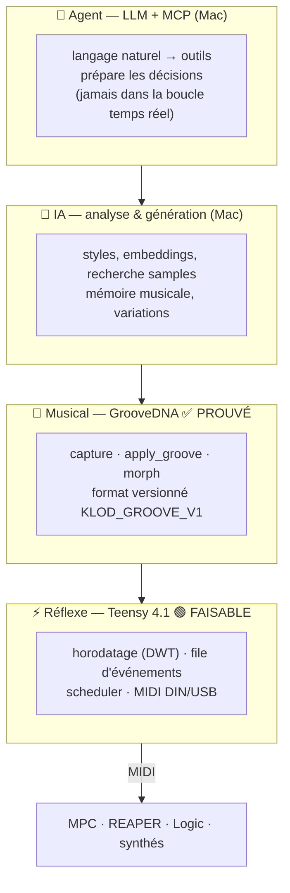
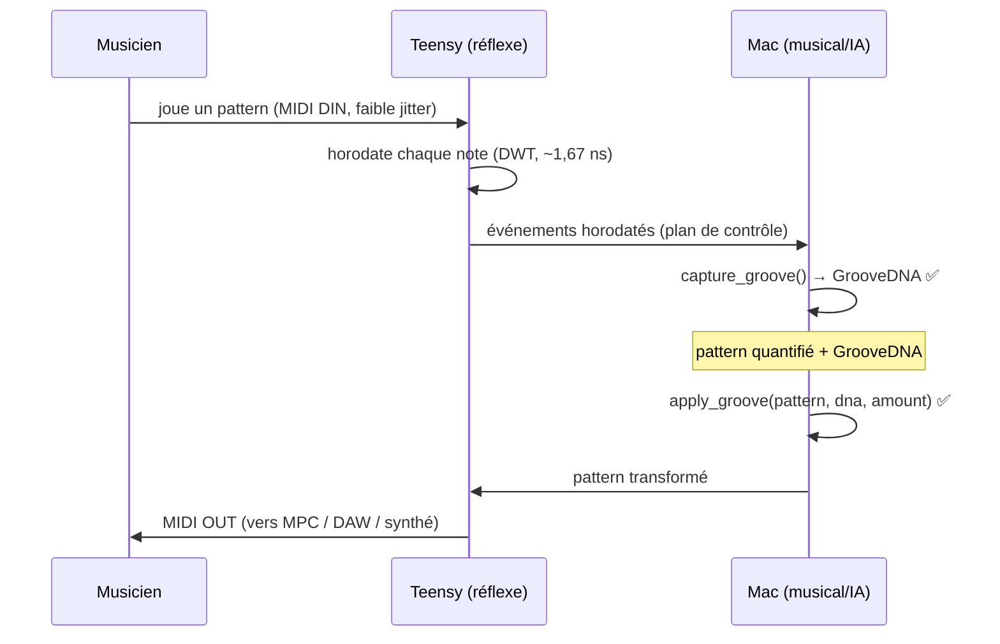
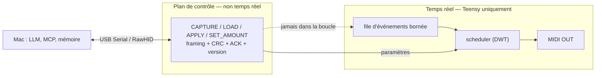

# ARCHITECTURE.md — KLOD Live Brain, architecture minimale de la V0

> Principe fondateur (§1) : **le Mac réfléchit, le Teensy exécute en temps
> réel.** On ne met jamais un LLM dans la boucle temporelle critique.

Ce document propose l'**architecture minimale** qui suffit à boucler la V0
(`MIDI IN → capture → GrooveDNA → apply → MIDI OUT`), et situe chaque brique par
rapport à ce qui est **prouvé** aujourd'hui. On ne construit **pas**
l'arborescence complète du cahier des charges tant que la chaîne n'est pas
bouclée sur matériel (§32 : « commencer minimal »).

---

## 1. Les 4 niveaux (découplage §9)



Chaque niveau reste **découplé** : le réflexe fonctionne **sans** les niveaux du
dessus (robustesse §27). Si le Mac ou le LLM tombe, le Teensy continue de
recevoir, capturer, appliquer un groove et jouer. **L'IA est une augmentation,
jamais une dépendance critique.**

Aujourd'hui : le niveau **Musical est prouvé** (Python, 35 tests) ; le niveau
**Réflexe est faisable mais non mesuré** ; les niveaux IA et Agent attendent
leurs backends (on ne crée pas d'outil MCP sans backend réel, §18).

---

## 2. Répartition Mac ↔ Teensy

| | **Teensy 4.1** (réflexe) | **Mac Apple Silicon** (cerveau) |
|---|---|---|
| Rôle | horloge, moteur déterministe, MIDI temps réel | IA, mémoire, analyse lourde, UI, MCP |
| Temps réel | **oui** (boucle critique) | non (plan de contrôle) |
| GrooveDNA | exécution (apply à la volée) — *portage à venir* | référence, capture/analyse, stockage — **prouvé** |
| Langage | C/C++ | Python |

Où tourne le moteur GrooveDNA ? **Les deux, à terme.** Il est écrit en couche
« musical » volontairement indépendante du transport : la **référence Python**
(prouvée ici) sert la capture, l'analyse et le stockage côté Mac ; le **portage
C++** embarqué appliquera le groove en temps réel sur le Teensy. Prouver le
moteur d'abord côté hôte **dérisque** ce portage.

---

## 3. Flux de données de la V0



**Décision clé (voir `TECHNICAL_REALITY.md` §3).** La **capture haute précision
passe par la DIN** (UART, réception octet par octet, jitter sub-ms), pas par
l'USB (qui regroupe les messages par intervalle de polling et écrase le
microtiming). C'est le **risque n°1** du projet, tranché par la mesure, pas par
la prose.

---

## 4. Frontière temps réel / plan de contrôle



Le LLM et MCP vivent **entièrement** dans le plan de contrôle : ils règlent des
paramètres (`amount`, groove chargé, tempo), ils ne cadencent **jamais** les
notes. C'est le **même verrou** que `microbit/` et EdgeSense de ce dépôt — MCP,
requête/réponse, ne peut pas *pousser* en millisecondes — et la **même réponse** :
le réflexe temps réel reste au plus près du matériel.

---

## 5. Structure du dépôt (minimale, actuelle)

```
klod-live-brain/
├── README.md
├── docs/
│   ├── TECHNICAL_REALITY.md   ← audit Phase 0 (statuts PROUVÉ/FAISABLE/…)
│   ├── GROOVEDNA_SPEC.md       ← format KLOD_GROOVE_V1 + maths
│   └── ARCHITECTURE.md         ← ce document
├── host/
│   └── groovedna/              ← moteur « musical », stdlib pur ✅ 35 tests
│       ├── groove.py           ← NoteEvent, GrooveDNA, capture/apply/morph
│       ├── demo.py             ← preuve exécutable du critère §38
│       └── test_groove.py
└── firmware/                   ← couche réflexe Teensy — 🟢 squelette FAISABLE, non mesuré
    ├── src/{config,midi,timing,queue,metrics}  ← file bornée ✅ testée en natif
    └── test/                   ← test natif (g++) de la file, sans Teensy
```

`mcp/`, `integrations/`, `ml/` n'arrivent **que lorsque leurs backends existent
réellement**. Le `firmware/` est un **squelette de référence** : sa seule pièce
indépendante du matériel (la file bornée) est testée en natif ; le reste (DWT,
E/S MIDI) ne compile que sous Teensyduino et attend la **mesure** (§6). Ordre
imposé par le cahier (§31) : MIDI core → GrooveDNA → transfert → morphing →
**pont Mac** → UI → MCP → IA. Chaque jalon n'ouvre qu'après validation du précédent.

---

## 6. Prochain jalon

Porter le niveau **Réflexe** sur Teensy et le **mesurer** (`BENCHMARKS.md`) :
horodatage DWT, file bornée + compteurs d'overrun (observabilité §28), scheduler,
capture DIN. Critère : jitter et latence **chiffrés**, aucune note perdue en
session longue. Tant que ce n'est pas mesuré, on n'emploie aucun qualificatif
comme « faible latence » ou « temps réel » (§30). Et l'on ne passe pas à l'IA
tant que la chaîne matérielle §38 n'est pas bouclée.
